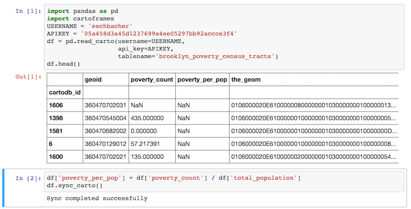
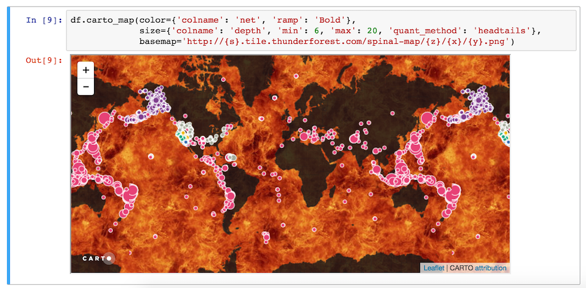

CartoFrames
===========

A pandas interface for integrating `Carto <https://carto.com/>`__ into a
data science workflow.

Example usage
-------------

Data workflow
~~~~~~~~~~~~~

Get table from carto, make changes in pandas, sync updates with carto:

.. code:: python

    import pandas as pd
    import cartoframes
    username = 'eschbacher'
    api_key = 'abcdefghijklmnopqrstuvwxyz'
    df = pd.read_carto(username=username,
                       api_key=api_key,
                       tablename='brooklyn_poverty_census_tracts')
    # do fancy pandas operations (add/drop columns, change values, etc.)
    df['poverty_per_pop'] = df['poverty_count'] / df['total_population']

    # updates carto table with all changes from this session
    # show all database access with debug=True
    df.sync_carto()

Map workflow
~~~~~~~~~~~~

The following will embed a CARTO map in a Jupyter notebook (interactive
or static).

.. code:: python

    df = pd.read_carto(username=username,
                       api_key=api_key,
                       tablename='brooklyn_poverty_census_tracts')
    df.carto_map(interactive=True, stylecol='poverty_per_pop')

Augment from Data Observatory
~~~~~~~~~~~~~~~~~~~~~~~~~~~~~

Not yet implemented
