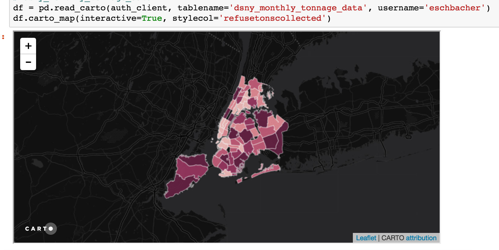

CartoFrames
===========

A pandas interface for integrating `Carto <https://carto.com/>`__ into a
data science workflow.

Example usage
-------------

Data workflow
~~~~~~~~~~~~~

Get table from carto, make changes in pandas, sync updates with carto:

.. code:: python

    import pandas as pd
    import carto
    import cartoframes

    cdb_auth_client = carto.auth.APIAuthClient(base_url, APIKEY)

    df = pd.read_carto(cdb_auth_client, 'tablename')
    # do fancy pandas operations (add/drop columns, change values, etc.)
    df.sync_carto() # updates carto table with all changes from this session

Map workflow
~~~~~~~~~~~~

The following will embed a CARTO map in a Jupyter notebook (interactive
or static).

.. code:: python

    df = pd.read_carto(auth_client, 'tablename')
    df.carto_map(interactive=True, stylecol='interesting_col')

Augment from Data Observatory
~~~~~~~~~~~~~~~~~~~~~~~~~~~~~

Not yet implemented
