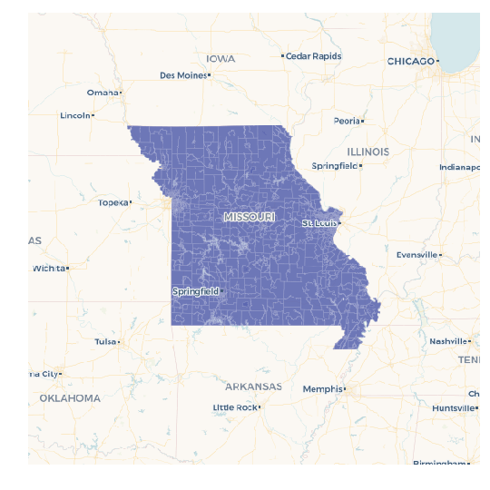
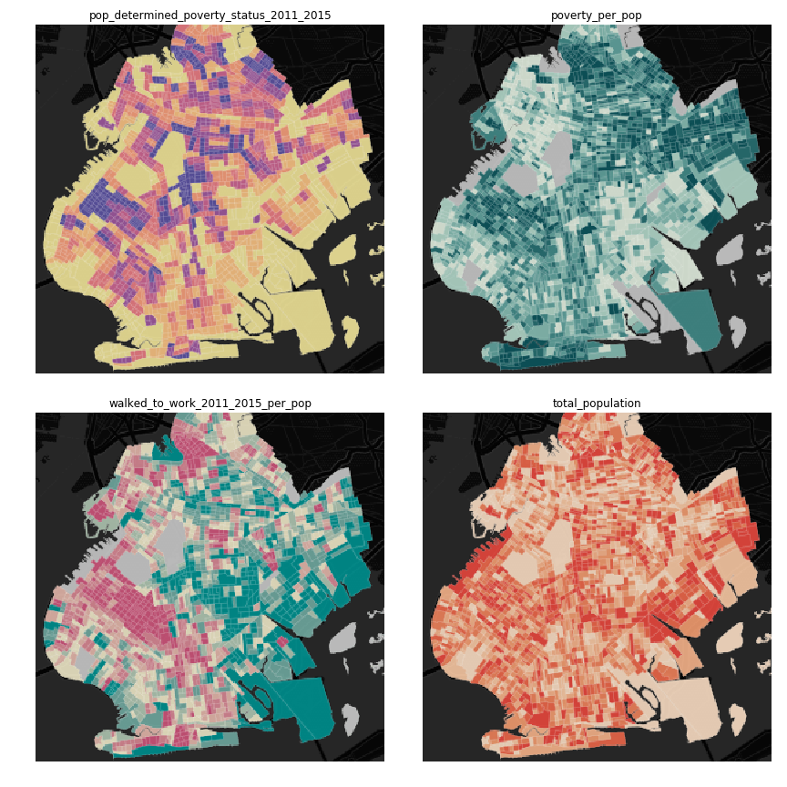

Cheat Sheet
===========

For most operations below, you need to create a :py:class:`CartoContext <cartoframes.context.CartoContext>` object. For example, here's how user `cyclingfan` with API key `abc123` creates one:

.. code::

    from cartoframes import CartoContext
    cc = CartoContext(
        base_url='https://cyclingfan.carto.com',
        api_key='abc123'
    )

How to get census tracts or counties for a state
------------------------------------------------

It's a fairly common use case that someone needs the Census tracts for a region. With cartoframes you have a lot of flexibility for obtaining this data.

1. Get bounding box of the region you're interested in. Tools like `Klockan's BoundingBox tool <https://boundingbox.klokantech.com/>`__ with the CSV output are prefect. Alternatively, use a table with the appropriate covering region (e.g., an existing table with polygon(s) of Missouri, its counties, etc.).
2. Get the FIPS code for the state(s) you're intersted in. The US Census `provides a table <https://www.census.gov/geo/reference/ansi_statetables.html>`__ as do many other sites. In this case, I'm choosing ``29`` for Missouri.

.. code::

   # get all census tracts (clipped by water boundaries) in specific bounding box
   missouri_ct = cc.data_boundaries(
       region=[-95.774147,35.995682,-89.098846,40.613636],
       boundary='us.census.tiger.census_tract_clipped'
   )

   # filter out all census tracts that begin with Missouri FIPS (29)
   # GEOIDs begin with two digit state FIPS, followed by three digit county FIPS
   missouri_ct = missouri_ct[missouri_ct.geom_refs.str.startswith('29')]

   # write to carto
   cc.write(missouri_ct, 'missouri_census_tracts')

   # visualize to make sure it makes sense
   cc.map(Layer('missouri_census_tracts'))

Since `pandas.Series.str.startswith` can take multiple string prefixes, we can filter for more than one state at a time. In this case, get all Missouri and Kansas counties:

.. code::

   # get all counties in bounding box around Kansas and Missouri
   ks_mo_counties = cc.data_boundaries(
       region=[-102.1777729674,35.995682,-89.098846,40.613636],
       boundary='us.census.tiger.county'
   )

   # filter out all counties that begin with Missouri (29) or Kansas (20) FIPS
   ks_mo_counties = ks_mo_counties[ks_mo_counties.geom_refs.str.startswith(('29', '20'))]

   # write to carto
   cc.write(ks_mo_counties, 'ks_mo_counties')

   # visualize to make sure it makes sense
   cc.map(Layer('ks_mo_counties'))

.. image:: img/cheatsheet_do_counties.png
   :alt: Map with counties for Kansas and Missouri

Get raw measures from the DO
----------------------------

To get raw census measures from the Data Observatory, the key part is the us of `predenominated` in the metadata and `how='geoid'` (or some other geom_ref) when using `CartoContext.data`.

Here we're using a dataset with a column called `geoid` which has the GEOID of census tracts. Note that it's important to specify the same geometry ID in the measure metadata as the geometries you are wishing to enrich.

1. Find the measures you want, either through `CartoContext.data_discovery` or using the `Data Observatory catalog <https://cartodb.github.io/bigmetadata/>`__.
2. Create a dataframe with columns for each measure metadata object, or a list of dictionaries (like below) for your curated measures. Be careful to specify the specific geometry level you want the measures for and make sure the geometry reference (e.g., GEOID) you have for your geometries matches this geometry leve.

.. code::

   # get median income for 2006 - 2010 and 2011 - 2015 five year estimates.
   meta = [{
       'numer_id': 'us.census.acs.B19013001',
       'geom_id': 'us.census.tiger.census_tract',
       'normalization': 'predenominated',
       'numer_timespan': '2006 - 2010'
   }, {
       'numer_id': 'us.census.acs.B19013001',
       'geom_id': 'us.census.tiger.census_tract',
       'normalization': 'predenominated',
       'numer_timespan': '2011 - 2015'
   }]

   boston_data = cc.data('boston_census_tracts', meta, how='geoid')

.. tip:: It's best practice to keep your geometry identifiers as strings because leading zeros are removed when strings are converted to numeric types. This usually affects states with FIPS that begin with a zero, or Zip Codes in New England with leading zeros.

Engineer your DO metadata if you already have GEOID or another geom_ref
-----------------------------------------------------------------------

Use `how='geom_ref_col'` and specify the appropriate boundary in the metadata.

How to get a matplotlib figure with four maps
---------------------------------------------

Creating a small multiple is a handy for data science visualizations for comparing data on multiple maps.

In this example, the :py:class:`example_context <cartoframes.examples.Examples>`.

.. code::

   from cartoframes import BaseMap, Layer, styling
   from cartoframes.examples import example_context
   import matplotlib.pyplot as plt

   # table in examples account
   # preview with:
   #    example_context.read_brooklyn_poverty()
   table = 'brooklyn_poverty'

   # columns and color scheme for visualization
   # view available columns with:
   #    example_context.read_brooklyn_poverty().columns
   cols = [('pop_determined_poverty_status_2011_2015', 'Sunset'),
           ('poverty_per_pop', 'Mint'),
           ('walked_to_work_2011_2015_per_pop', 'TealRose'),
           ('total_population', 'Peach')]

   fig, axs = plt.subplots(2, 2, figsize=(8, 8))

   for idx, col in enumerate(cols):
       example_context.map(layers=[BaseMap('dark'), Layer(table,
                           color={'column': col[0],
                                  'scheme': styling.scheme(col[1], 7, 'quantiles')})],
             ax=axs[idx // 2][idx % 2],
             zoom=11, lng=-73.9476, lat=40.6437,
             interactive=False,
             size=(288, 288))
       axs[idx // 2][idx % 2].set_title(col[0])
   fig.tight_layout()
   plt.show()

Get a table as a GeoDataFrame
-----------------------------

CARTOframes works with GeoPandas.

1. For any `CartoContext.read` or `CartoContext.query` operation, use the `decode_geom` flag set to ``True``, like below.
2. Wrap the result of step 1 in the GeoPandas GeoDataFrame constructor

Your new GeoDataFrame will now have geometries decoded into Shapely objects that can then be used for spatial operations in your Python environment.

.. code::

   from cartoframes import CartoContext
   import geopandas as gpd
   cc = CartoContext()

   gdf = gpd.GeoDataFrame(cc.read('tablename', decode_geom=True))

You can reverse this process and have geometries encoded for storage in CARTO by specifying `encode_geom=True` in the `CartoContext.write` operation.

Skip SSL verification
---------------------

Some `on premises installations of CARTO <https://carto.com/developers/on-premises/>`__ don't need SSL verification. You can disable this using the requests library's `Session class <http://docs.python-requests.org/en/master/user/advanced/#session-objects>`__ and passing that into your :py:class:`CartoContext <cartoframes.context.CartoConext>`.

.. code::

   from requests import Session
   session = Session()
   session.verify = False

   cc = CartoContext(
       base_url='https://cyclingfan.carto.com/',
       api_key='abc123',
       session=session
   )

Reading large tables or queries
-------------------------------

Sometimes tables are too large to read them out in a single `CartoContext.read` or `CartoContext.query` operation. In this case, you can read chunks and recombine, like below:

.. code::

   import pandas as pd

   # storage for chunks of table
   dfs = []

   # template query
   q = '''
   SELECT * FROM my_big_table
   WHERE cartodb_id >= {lower} and cartodb_id < {upper}
   '''

   num_rows = cc.sql_client.send('select count(*) from my_big_table')['rows'][0]['count']

   # read in 100,000 chunks
   for r in range(0, num_rows, 100000):
       dfs.append(cc.query(q.format(lower=r, upper=r+100000)))

   # combine 'em all
   all_together = pd.concat(dfs)
   del dfs

When writing large DataFrames to CARTO, cartoframes takes care of the batching. Users shouldn't hit errors in general until they run out of storage in their database.
