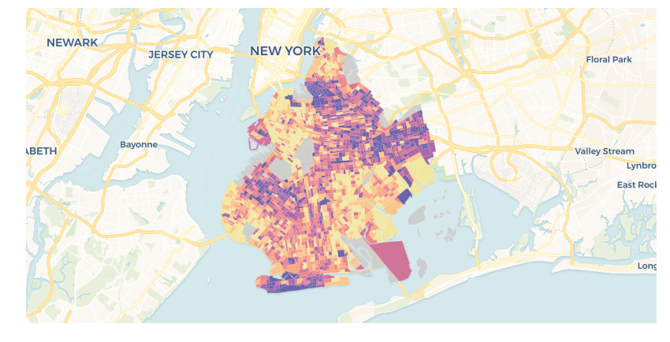
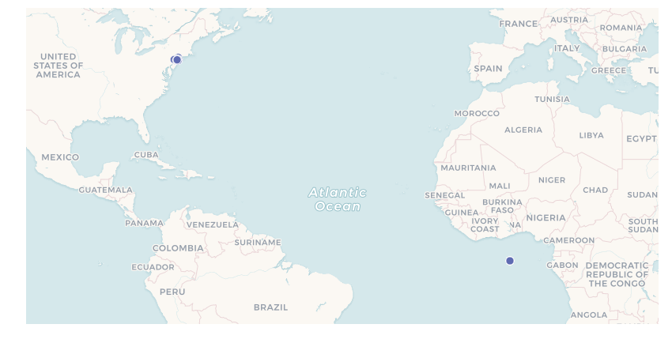
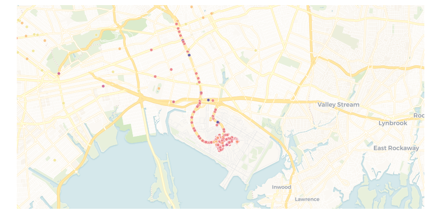

# Basic cartoframes usage

`cartoframes` lets you use CARTO in a Python environment so that you can do all of your analysis and mapping in, for example, a Jupyter notebook. `cartoframes` allows you to use CARTO's functionality for data analysis, storage, location services like routing and geocoding, and visualization.

You can view this notebook best on `nbviewer` here: <https://nbviewer.jupyter.org/github/CartoDB/cartoframes/blob/master/examples/Basic%20Usage.ipynb>
It is recommended to download this notebook and use on your computer instead so you can more easily explore the functionality of `cartoframes`.

To get started, let's load the required packages, and set credentials.


```python
%matplotlib inline
import matplotlib.pyplot as plt
import cartoframes
from cartoframes import Credentials
import pandas as pd

USERNAME = 'eschbacher'  # <-- replace with your username
APIKEY = 'abcdefg'       # <-- your CARTO API key
creds = Credentials(username=USERNAME,
                    key=APIKEY)
cc = cartoframes.CartoContext(creds=creds)
```

## `cc.read`

`CartoContext` has several methods for interacting with [CARTO](https://carto.com) in a Python environment. `CartoContext.read` allows you to pull a dataset stored on CARTO into a [pandas](http://pandas.pydata.org/) DataFrame. In the cell below, we use `read_taxi` to get the table `brooklyn_poverty` from a CARTO account.


```python
from cartoframes.examples import read_brooklyn_poverty
cc.write(read_brooklyn_poverty(), 'brooklyn_poverty_example', overwrite=True)
```

    Table successfully written to CARTO: https://eschbacher.carto.com/dataset/brooklyn_poverty_example


```python
# Get a CARTO table as a pandas DataFrame
df = cc.read('brooklyn_poverty_example')
df.head()
```


<div>
<style scoped>
    .dataframe tbody tr th:only-of-type {
        vertical-align: middle;
    }

    .dataframe tbody tr th {
        vertical-align: top;
    }

    .dataframe thead th {
        text-align: right;
    }
</style>
<table border="1" class="dataframe">
  <thead>
    <tr style="text-align: right;">
      <th></th>
      <th>commuters_16_over_2011_2015</th>
      <th>geoid</th>
      <th>pop_determined_poverty_status_2011_2015</th>
      <th>poverty_count</th>
      <th>poverty_per_pop</th>
      <th>the_geom</th>
      <th>total_pop_2011_2015</th>
      <th>total_population</th>
      <th>walked_to_work_2011_2015_per_pop</th>
    </tr>
    <tr>
      <th>cartodb_id</th>
      <th></th>
      <th></th>
      <th></th>
      <th></th>
      <th></th>
      <th></th>
      <th></th>
      <th></th>
      <th></th>
    </tr>
  </thead>
  <tbody>
    <tr>
      <th>1606</th>
      <td>0.0</td>
      <td>360470702031</td>
      <td>0.0</td>
      <td>NaN</td>
      <td>NaN</td>
      <td>0106000020E61000000800000001030000000100000013...</td>
      <td>0.0</td>
      <td>0</td>
      <td>NaN</td>
    </tr>
    <tr>
      <th>2052</th>
      <td>NaN</td>
      <td>360479901000</td>
      <td>NaN</td>
      <td>NaN</td>
      <td>NaN</td>
      <td>None</td>
      <td>NaN</td>
      <td>0</td>
      <td>NaN</td>
    </tr>
    <tr>
      <th>111</th>
      <td>0.0</td>
      <td>360470666001</td>
      <td>0.0</td>
      <td>NaN</td>
      <td>NaN</td>
      <td>0106000020E6100000030000000103000000010000006B...</td>
      <td>0.0</td>
      <td>0</td>
      <td>1.553393e-12</td>
    </tr>
    <tr>
      <th>116</th>
      <td>NaN</td>
      <td>360470702030</td>
      <td>NaN</td>
      <td>NaN</td>
      <td>NaN</td>
      <td>None</td>
      <td>NaN</td>
      <td>0</td>
      <td>NaN</td>
    </tr>
    <tr>
      <th>91</th>
      <td>15928.0</td>
      <td>360470080002</td>
      <td>31367.0</td>
      <td>225.0</td>
      <td>0.17201</td>
      <td>0106000020E61000000100000001030000000100000007...</td>
      <td>39471.0</td>
      <td>1309</td>
      <td>1.505213e-02</td>
    </tr>
  </tbody>
</table>
</div>


Notice that:

* the index of the DataFrame is the same as the index of the CARTO table (`cartodb_id`)
* `the_geom` column stores the geometry. This can be decoded if we set the `decode_geom=True` flag in `cc.read`, which requires the library `shapely`.
* We have several numeric columns
* SQL `null` values are represented as `numpy.nan`

Other things to notice:


```python
df.dtypes
```


    commuters_16_over_2011_2015                float64
    geoid                                       object
    pop_determined_poverty_status_2011_2015    float64
    poverty_count                              float64
    poverty_per_pop                            float64
    the_geom                                    object
    total_pop_2011_2015                        float64
    total_population                             int64
    walked_to_work_2011_2015_per_pop           float64
    dtype: object


The `dtype` of each column is a mapping of the column type on CARTO. For example, `numeric` will map to `float64`, `text` will map to `object` (pandas string representation), `timestamp` will map to `datetime64[ns]`, etc. The reverse happens if a DataFrame is sent to CARTO.

## `cc.map`

Now that we can inspect the data, we can map it to see how the values change over the geography. We can use the `cc.map` method for this purpose.

`cc.map` takes a `layers` argument which specifies the data layers that are to be visualized. They can be imported from `cartoframes` as below.

There are different types of layers:

* `Layer` for visualizing CARTO tables
* `QueryLayer` for visualizing arbitrary queries from tables in user's CARTO account
* `BaseMap` for specifying the base map to be used

Each of the layers has different styling options. `Layer` and `QueryLayer` take the same styling arguments, and `BaseMap` can be specified to be light/dark and options on label placement.

Maps can be `interactive` or not. Set interactivity with the `interactive` with `True` or `False`. If the map is static (not interactive), it will be embedded in the notebook as either a `matplotlib` axis or `IPython.Image`. Either way, the image will be transported with the notebook. Interactive maps will be embedded zoom and pan-able maps.


```python
from cartoframes import Layer, styling, BaseMap
l = Layer('brooklyn_poverty_example',
          color={'column': 'poverty_per_pop',
                 'scheme': styling.sunset(7)})
cc.map(layers=l,
       interactive=False)
```


    <matplotlib.axes._subplots.AxesSubplot at 0x10630a320>





### Multiple variables together


```python
table = 'brooklyn_poverty_example'
cols = [
    'pop_determined_poverty_status_2011_2015',
    'poverty_per_pop',
    'walked_to_work_2011_2015_per_pop',
    'total_pop_2011_2015'
]

fig, axs = plt.subplots(2, 2, figsize=(12, 12))

for idx, col in enumerate(cols):
    cc.map(layers=[BaseMap('dark'), Layer(table,
                        color={'column': col,
                               'scheme': styling.sunset(7, 'quantiles')})],
           ax=axs[idx // 2][idx % 2],
           zoom=11, lng=-73.9476, lat=40.6437,
           interactive=False,
           size=(432, 432))
    axs[idx // 2][idx % 2].set_title(col)
fig.tight_layout()
plt.show()
```


## NYC Taxi Dataset

Let's explore a typical `cartoframes` workflow using data on NYC taxis.

To get the data into CARTO, we can:
1. Use `pandas` to grab the data from the cartoframes example account
2. Send it to your CARTO account using `cc.write`, specifying the `lng`/`lat` columns you want to use for visualization
3. Set `overwrite=True` to replace an existing dataset if it exists
4. Refresh our `df` with the CARTO-fied version using `cc.read``


```python
# read in a CSV of NYC taxi data from cartoframes example datasets
from cartoframes.examples import read_taxi
df = read_taxi()

# show first five rows to see what we've got
df.head()
```


<div>
<style scoped>
    .dataframe tbody tr th:only-of-type {
        vertical-align: middle;
    }

    .dataframe tbody tr th {
        vertical-align: top;
    }

    .dataframe thead th {
        text-align: right;
    }
</style>
<table border="1" class="dataframe">
  <thead>
    <tr style="text-align: right;">
      <th></th>
      <th>dropoff_latitude</th>
      <th>dropoff_longitude</th>
      <th>extra</th>
      <th>fare_amount</th>
      <th>improvement_surcharge</th>
      <th>mta_tax</th>
      <th>passenger_count</th>
      <th>payment_type</th>
      <th>pickup_latitude</th>
      <th>pickup_longitude</th>
      <th>ratecodeid</th>
      <th>store_and_fwd_flag</th>
      <th>the_geom</th>
      <th>tip_amount</th>
      <th>tolls_amount</th>
      <th>total_amount</th>
      <th>tpep_dropoff_datetime</th>
      <th>tpep_pickup_datetime</th>
      <th>trip_distance</th>
      <th>vendorid</th>
    </tr>
    <tr>
      <th>cartodb_id</th>
      <th></th>
      <th></th>
      <th></th>
      <th></th>
      <th></th>
      <th></th>
      <th></th>
      <th></th>
      <th></th>
      <th></th>
      <th></th>
      <th></th>
      <th></th>
      <th></th>
      <th></th>
      <th></th>
      <th></th>
      <th></th>
      <th></th>
      <th></th>
    </tr>
  </thead>
  <tbody>
    <tr>
      <th>1</th>
      <td>40.706779</td>
      <td>-74.012383</td>
      <td>0.0</td>
      <td>8.5</td>
      <td>0.3</td>
      <td>0.5</td>
      <td>2</td>
      <td>1</td>
      <td>40.730461</td>
      <td>-74.006706</td>
      <td>1</td>
      <td>False</td>
      <td>None</td>
      <td>1.00</td>
      <td>0.0</td>
      <td>10.30</td>
      <td>2016-05-01 15:00:36</td>
      <td>2016-05-01 14:52:11</td>
      <td>2.08</td>
      <td>2</td>
    </tr>
    <tr>
      <th>2</th>
      <td>40.762779</td>
      <td>-73.973824</td>
      <td>0.0</td>
      <td>13.5</td>
      <td>0.3</td>
      <td>0.5</td>
      <td>1</td>
      <td>1</td>
      <td>40.744125</td>
      <td>-73.924957</td>
      <td>1</td>
      <td>False</td>
      <td>None</td>
      <td>2.00</td>
      <td>0.0</td>
      <td>16.30</td>
      <td>2016-05-01 08:49:02</td>
      <td>2016-05-01 08:34:08</td>
      <td>3.00</td>
      <td>1</td>
    </tr>
    <tr>
      <th>3</th>
      <td>40.740833</td>
      <td>-73.998955</td>
      <td>0.0</td>
      <td>14.5</td>
      <td>0.3</td>
      <td>0.5</td>
      <td>1</td>
      <td>2</td>
      <td>40.748501</td>
      <td>-73.973488</td>
      <td>1</td>
      <td>False</td>
      <td>None</td>
      <td>0.00</td>
      <td>0.0</td>
      <td>15.30</td>
      <td>2016-05-04 10:07:09</td>
      <td>2016-05-04 09:44:40</td>
      <td>2.10</td>
      <td>1</td>
    </tr>
    <tr>
      <th>4</th>
      <td>40.792370</td>
      <td>-73.966362</td>
      <td>0.5</td>
      <td>15.0</td>
      <td>0.3</td>
      <td>0.5</td>
      <td>1</td>
      <td>2</td>
      <td>40.743267</td>
      <td>-73.999786</td>
      <td>1</td>
      <td>False</td>
      <td>None</td>
      <td>0.00</td>
      <td>0.0</td>
      <td>16.30</td>
      <td>2016-05-01 21:05:24</td>
      <td>2016-05-01 20:50:11</td>
      <td>4.41</td>
      <td>2</td>
    </tr>
    <tr>
      <th>5</th>
      <td>40.784939</td>
      <td>-73.956963</td>
      <td>0.0</td>
      <td>19.5</td>
      <td>0.3</td>
      <td>0.5</td>
      <td>2</td>
      <td>1</td>
      <td>40.803360</td>
      <td>-73.963631</td>
      <td>1</td>
      <td>False</td>
      <td>None</td>
      <td>4.06</td>
      <td>0.0</td>
      <td>24.36</td>
      <td>2016-05-02 07:53:53</td>
      <td>2016-05-02 07:26:56</td>
      <td>4.01</td>
      <td>2</td>
    </tr>
  </tbody>
</table>
</div>


```python
# send it to carto so we can map it
# specify the columns we want to have as a point (pickup location)
cc.write(df, 'taxi_50k',
         lnglat=('pickup_longitude', 'pickup_latitude'),
         overwrite=True)

# read the fresh carto-fied version
df = cc.read('taxi_50k')
```

    Table successfully written to CARTO: https://eschbacher.carto.com/dataset/taxi_50k
    `the_geom` column is being populated from `('pickup_longitude', 'pickup_latitude')`. Check the status of the operation with:
        BatchJobStatus(CartoContext(), '787ce294-3fce-47d0-8390-5599c4fc35c8').status()
    or try reading the table from CARTO in a couple of minutes.
    Note: `CartoContext.map` will not work on this table until its geometries are created.


Take a look at the data on a map.


```python
from cartoframes import Layer
cc.map(layers=Layer('taxi_50k'),
       interactive=False)
```


    <matplotlib.axes._subplots.AxesSubplot at 0x107b87be0>





Oops, there are some zero-valued long/lats in there, so the results are going to [null island](https://en.wikipedia.org/wiki/Null_Island). Let's remove them.


```python
# select only the rows which are not at (0,0)
df = df[(df['pickup_longitude'] != 0) | (df['pickup_latitude'] != 0)]
# send back up to CARTO
cc.write(df, 'taxi_50k', overwrite=True,
         lnglat=('pickup_longitude', 'pickup_latitude'))
```

    Table successfully written to CARTO: https://eschbacher.carto.com/dataset/taxi_50k
    `the_geom` column is being populated from `('pickup_longitude', 'pickup_latitude')`. Check the status of the operation with:
        BatchJobStatus(CartoContext(), '292c4b72-965a-4b17-970c-8527b85eced4').status()
    or try reading the table from CARTO in a couple of minutes.
    Note: `CartoContext.map` will not work on this table until its geometries are created.


    BatchJobStatus(job_id='292c4b72-965a-4b17-970c-8527b85eced4', last_status='pending', created_at='2018-06-26T13:47:06.959Z')


Instead of using pandas, we could have remove those rows on the database by using SQL.

```python
cc.query('''
DELETE FROM taxi_50k
WHERE pickup_longitude = 0 and pickup_latitude = 0
''')
```


```python
# Let's take a look at what's going on, styled by the fare amount
cc.map(layers=Layer('taxi_50k',
                    size=4,
                    color={'column': 'fare_amount',
                           'scheme': styling.sunset(7)}),
       interactive=True)
```


<iframe srcdoc="<!DOCTYPE html>
<html>
  <head>
    <title>Carto</title>
    <meta name='viewport' content='initial-scale=1.0, user-scalable=no' />
    <meta http-equiv='content-type' content='text/html; charset=UTF-8' />
    <link rel='shortcut icon' href='http://cartodb.com/assets/favicon.ico' />

    <style>
     html, body, #map {
       height: 100%;
       padding: 0;
       margin: 0;
     }
     #zoom-center {
       position: absolute;
       right: 0;
       top: 0;
       background-color: rgba(255, 255, 255, 0.7);
       width: 240px;
       z-index: 100;
       padding: 4px;
     }
    </style>

    <link rel='stylesheet' href='https://cartodb-libs.global.ssl.fastly.net/cartodb.js/v3/3.15/themes/css/cartodb.css' />
  </head>
  <body>
    <div id='zoom-center'>
      zoom=<span id='zoom'>4</span>,
      lng=<span id='lon'>No data</span>, lat=<span id='lat'>No data</span>
    </div>
    <div id='map'></div>
    <script src='https://cartodb-libs.global.ssl.fastly.net/cartodb.js/v3/3.15/cartodb.js'></script>

    <script>
     const config  = {&quot;user_name&quot;: &quot;eschbacher&quot;, &quot;maps_api_template&quot;: &quot;https://eschbacher.carto.com&quot;, &quot;sql_api_template&quot;: &quot;https://eschbacher.carto.com&quot;, &quot;tiler_protocol&quot;: &quot;https&quot;, &quot;tiler_domain&quot;: &quot;carto.com&quot;, &quot;tiler_port&quot;: &quot;80&quot;, &quot;type&quot;: &quot;namedmap&quot;, &quot;named_map&quot;: {&quot;name&quot;: &quot;cartoframes_ver20170406_layers1_time0_baseid2_labels0_zoom0&quot;, &quot;params&quot;: {&quot;basemap_url&quot;: &quot;https://{s}.basemaps.cartocdn.com/rastertiles/voyager_labels_under/{z}/{x}/{y}.png&quot;, &quot;cartocss_0&quot;: &quot;#layer {  marker-width: 4; marker-fill: ramp([fare_amount], cartocolor(Sunset), quantiles(7), >); marker-fill-opacity: 0.9; marker-allow-overlap: true; marker-line-width: 0.5; marker-line-color: #FFF; marker-line-opacity: 1;}#layer[fare_amount = null] {  marker-fill: #ccc;}&quot;, &quot;sql_0&quot;: &quot;SELECT * FROM taxi_50k&quot;, &quot;west&quot;: -74.6638793945312, &quot;south&quot;: 40.5904769897461, &quot;east&quot;: -73.5582504272461, &quot;north&quot;: 41.1549949645996}}};
     const bounds  = [[41.1549949645996, -73.5582504272461], [40.5904769897461, -74.6638793945312]];
     const options = {&quot;filter&quot;: [&quot;mapnik&quot;, &quot;torque&quot;], &quot;https&quot;: true};
     var labels_url = '';

     const adjustLongitude = (lng) => (
       lng - ((Math.ceil((lng + 180) / 360) - 1) * 360)
     );
     const map = L.map('map', {
       zoom: 3,
       center: [0, 0],
     });

     if (L.Browser.retina) {
         var basemap = config.named_map.params.basemap_url.replace('.png', '@2x.png');
         labels_url = labels_url.replace('.png', '@2x.png');
     } else {
         var basemap = config.named_map.params.basemap_url;
     }
     L.tileLayer(basemap, {
         attribution: &quot;&copy; <a href=\&quot;http://www.openstreetmap.org/copyright\&quot;>OpenStreetMap</a>&quot;
     }).addTo(map);

     const updateMapInfo = () => {
       $('#zoom').text(map.getZoom());
       $('#lat').text(map.getCenter().lat.toFixed(4));
       $('#lon').text(adjustLongitude(map.getCenter().lng).toFixed(4));
     };

     cartodb.createLayer(map, config, options)
            .addTo(map)
            .done((layer) => {
                // add labels layer
                if (labels_url) {
                    var topPane = L.DomUtil.create('div', 'leaflet-top-pane', map.getPanes().mapPane);
                    var topLayer = new L.tileLayer(labels_url).addTo(map);
                    topPane.appendChild(topLayer.getContainer());
                    topLayer.setZIndex(7);
                 }

                // fit map to bounds
                if (bounds.length) {
                  map.fitBounds(bounds);
                }

                updateMapInfo();
                map.on('move', () => {
                  updateMapInfo();
                });
            })
            .error((err) => {
              console.log('ERROR: ', err);
            });
    </script>

  </body>
</html>
" width="100%" height="400">  Preview image: </iframe>


We can use the `zoom=..., lng=..., lat=...` information in the embedded interactive map to help us get static snapshots of the regions we're interested in. For example, JFK airport is around `zoom=12, lng=-73.7880, lat=40.6629`. We can paste that information as arguments in `cc.map` to generate a static snapshot of the data there.


```python
# Let's take a look at what's going on at JFK airport, styled by the fare amount, and STATIC
cc.map(layers=Layer('taxi_50k',
                    size=6,
                    color={'column': 'fare_amount',
                           'scheme': styling.sunset(7)}),
       zoom=12, lng=-73.7880, lat=40.6629,
       interactive=False)
```


    <matplotlib.axes._subplots.AxesSubplot at 0x10e5024a8>



