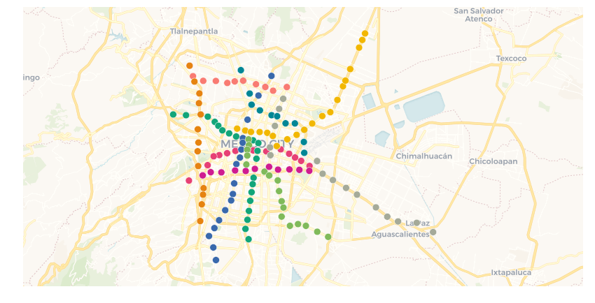

# Data Observatory in cartoframes

The [Data Observatory](https://carto.com/data-observatory/) can be accessed through CARTOframes. This is a basic demonstration how one would pull down new measures for building a feature set for training a model.


```python
%matplotlib inline
import cartoframes
from cartoframes import QueryLayer, Layer, styling
import pandas as pd

# Enter your username and api key below
cc = cartoframes.CartoContext(base_url='https://{username}.carto.com/'.format(username=''),
                              api_key='')
```

## Getting Mexico City Metro station coordinates

Use pandas to download an Excel spreadsheet into a dataframe.


```python
# Metro stations from here:
#  https://github.com/josecarlosgonz/mexicoCityMetro/blob/master/coordsMetro.xlsx
df = pd.read_excel('https://github.com/josecarlosgonz/mexicoCityMetro/blob/master/coordsMetro.xlsx?raw=true')
df.head()
```


<div>
<style scoped>
    .dataframe tbody tr th:only-of-type {
        vertical-align: middle;
    }

    .dataframe tbody tr th {
        vertical-align: top;
    }

    .dataframe thead th {
        text-align: right;
    }
</style>
<table border="1" class="dataframe">
  <thead>
    <tr style="text-align: right;">
      <th></th>
      <th>Name</th>
      <th>latitude</th>
      <th>longitude</th>
      <th>Unnamed: 3</th>
      <th>linea</th>
      <th>estacion</th>
      <th>afluencia</th>
      <th>latitude.1</th>
      <th>longitude.1</th>
    </tr>
  </thead>
  <tbody>
    <tr>
      <th>0</th>
      <td>Pantitlán</td>
      <td>19.4163</td>
      <td>-99.0747</td>
      <td>NaN</td>
      <td>1</td>
      <td>Pantitlán</td>
      <td>4513549.0</td>
      <td>19.4163</td>
      <td>-99.0747</td>
    </tr>
    <tr>
      <th>1</th>
      <td>Zaragoza</td>
      <td>19.4117</td>
      <td>-99.0821</td>
      <td>NaN</td>
      <td>1</td>
      <td>Zaragoza</td>
      <td>5144223.0</td>
      <td>19.4117</td>
      <td>-99.0821</td>
    </tr>
    <tr>
      <th>2</th>
      <td>Gómez Farías</td>
      <td>19.4165</td>
      <td>-99.0904</td>
      <td>NaN</td>
      <td>1</td>
      <td>Gómez Farías</td>
      <td>3665025.0</td>
      <td>19.4165</td>
      <td>-99.0904</td>
    </tr>
    <tr>
      <th>3</th>
      <td>Boulevard Puerto Aéreo</td>
      <td>19.4196</td>
      <td>-99.0963</td>
      <td>NaN</td>
      <td>1</td>
      <td>Boulevard Puerto Aéreo</td>
      <td>3611591.0</td>
      <td>19.4196</td>
      <td>-99.0963</td>
    </tr>
    <tr>
      <th>4</th>
      <td>Balbuena</td>
      <td>19.4231</td>
      <td>-99.1021</td>
      <td>NaN</td>
      <td>1</td>
      <td>Balbuena</td>
      <td>1822229.0</td>
      <td>19.4231</td>
      <td>-99.1021</td>
    </tr>
  </tbody>
</table>
</div>


Send to CARTO, being sure to specify the to-be-normalized column names `latitude.1` -> `latitude_1`, etc.


```python
orig_table = 'coordsmetro_demo'
cc.write(df, orig_table, lnglat=('longitude_1', 'latitude_1'), overwrite=True)
```

    The following columns were changed in the CARTO copy of this dataframe:
    Name -> name
    Unnamed: 3 -> unnamed_3
    latitude.1 -> latitude_1
    longitude.1 -> longitude_1
    Table successfully written to CARTO: https://cartoframes.carto.com/dataset/coordsmetro_demo


## See the data by `linea`

_Note: notice the basemap labels are default on the bottom._


```python
cc.map(layers=Layer(orig_table,
                    color={'column': 'linea',
                           'scheme': styling.bold(10)}))
```


<iframe srcdoc="<!DOCTYPE html>
<html>
  <head>
    <title>Carto</title>
    <meta name='viewport' content='initial-scale=1.0, user-scalable=no' />
    <meta http-equiv='content-type' content='text/html; charset=UTF-8' />
    <link rel='shortcut icon' href='http://cartodb.com/assets/favicon.ico' />

    <style>
     html, body, #map {
       height: 100%;
       padding: 0;
       margin: 0;
     }
     #zoom-center {
       position: absolute;
       right: 0;
       top: 0;
       background-color: rgba(255, 255, 255, 0.7);
       width: 240px;
       z-index: 100;
       padding: 4px;
     }
    </style>

    <link rel='stylesheet' href='https://cartodb-libs.global.ssl.fastly.net/cartodb.js/v3/3.15/themes/css/cartodb.css' />
  </head>
  <body>
    <div id='zoom-center'>
      zoom=<span id='zoom'>4</span>,
      lng=<span id='lon'>No data</span>, lat=<span id='lat'>No data</span>
    </div>
    <div id='map'></div>
    <script src='https://cartodb-libs.global.ssl.fastly.net/cartodb.js/v3/3.15/cartodb.js'></script>

    <script>
     const config  = {&quot;user_name&quot;: &quot;eschbacher&quot;, &quot;maps_api_template&quot;: &quot;https://eschbacher.carto.com&quot;, &quot;sql_api_template&quot;: &quot;https://eschbacher.carto.com&quot;, &quot;tiler_protocol&quot;: &quot;https&quot;, &quot;tiler_domain&quot;: &quot;carto.com&quot;, &quot;tiler_port&quot;: &quot;80&quot;, &quot;type&quot;: &quot;namedmap&quot;, &quot;named_map&quot;: {&quot;name&quot;: &quot;cartoframes_ver20170406_layers1_time0_baseid2_labels0_zoom0&quot;, &quot;params&quot;: {&quot;basemap_url&quot;: &quot;https://{s}.basemaps.cartocdn.com/rastertiles/voyager_labels_under/{z}/{x}/{y}.png&quot;, &quot;cartocss_0&quot;: &quot;#layer {  marker-width: 10; marker-fill: ramp([linea], cartocolor(Bold), category(10), =); marker-fill-opacity: 0.9; marker-allow-overlap: true; marker-line-width: 0.5; marker-line-color: #FFF; marker-line-opacity: 1;}#layer[linea = null] {  marker-fill: #ccc;}&quot;, &quot;sql_0&quot;: &quot;SELECT * FROM coordsmetro_demo&quot;, &quot;west&quot;: -99.2159, &quot;south&quot;: 19.3244, &quot;east&quot;: -98.9609, &quot;north&quot;: 19.5346}}};
     const bounds  = [[19.5346, -98.9609], [19.3244, -99.2159]];
     const options = {&quot;filter&quot;: [&quot;mapnik&quot;, &quot;torque&quot;], &quot;https&quot;: true};
     var labels_url = '';

     const adjustLongitude = (lng) => (
       lng - ((Math.ceil((lng + 180) / 360) - 1) * 360)
     );
     const map = L.map('map', {
       zoom: 3,
       center: [0, 0],
     });

     if (L.Browser.retina) {
         var basemap = config.named_map.params.basemap_url.replace('.png', '@2x.png');
         labels_url = labels_url.replace('.png', '@2x.png');
     } else {
         var basemap = config.named_map.params.basemap_url;
     }
     L.tileLayer(basemap, {
         attribution: &quot;&copy; <a href=\&quot;http://www.openstreetmap.org/copyright\&quot;>OpenStreetMap</a>&quot;
     }).addTo(map);

     const updateMapInfo = () => {
       $('#zoom').text(map.getZoom());
       $('#lat').text(map.getCenter().lat.toFixed(4));
       $('#lon').text(adjustLongitude(map.getCenter().lng).toFixed(4));
     };

     cartodb.createLayer(map, config, options)
            .addTo(map)
            .done((layer) => {
                // add labels layer
                if (labels_url) {
                    var topPane = L.DomUtil.create('div', 'leaflet-top-pane', map.getPanes().mapPane);
                    var topLayer = new L.tileLayer(labels_url).addTo(map);
                    topPane.appendChild(topLayer.getContainer());
                    topLayer.setZIndex(7);
                 }

                // fit map to bounds
                if (bounds.length) {
                  map.fitBounds(bounds);
                }

                updateMapInfo();
                map.on('move', () => {
                  updateMapInfo();
                });
            })
            .error((err) => {
              console.log('ERROR: ', err);
            });
    </script>

  </body>
</html>
" width="100%" height="400">  Preview image: </iframe>


See a static version of the map above


```python
cc.map(layers=Layer(orig_table,
                    color={'column': 'linea',
                           'scheme': styling.bold(10)}),
       interactive=False)
```


    <matplotlib.axes._subplots.AxesSubplot at 0x10d065358>





## Data Observatory measures in the Mexico City area

Let's get education-related Data Observatory measures around the metro stops.


```python
meta = cc.data_discovery(region=orig_table, keywords='education')
meta.head()
```


<div>
<style scoped>
    .dataframe tbody tr th:only-of-type {
        vertical-align: middle;
    }

    .dataframe tbody tr th {
        vertical-align: top;
    }

    .dataframe thead th {
        text-align: right;
    }
</style>
<table border="1" class="dataframe">
  <thead>
    <tr style="text-align: right;">
      <th></th>
      <th>denom_aggregate</th>
      <th>denom_colname</th>
      <th>denom_description</th>
      <th>denom_geomref_colname</th>
      <th>denom_id</th>
      <th>denom_name</th>
      <th>denom_reltype</th>
      <th>denom_t_description</th>
      <th>denom_tablename</th>
      <th>denom_type</th>
      <th>...</th>
      <th>numer_timespan</th>
      <th>numer_type</th>
      <th>score</th>
      <th>score_rank</th>
      <th>score_rownum</th>
      <th>suggested_name</th>
      <th>target_area</th>
      <th>target_geoms</th>
      <th>timespan_rank</th>
      <th>timespan_rownum</th>
    </tr>
  </thead>
  <tbody>
    <tr>
      <th>0</th>
      <td>sum</td>
      <td>employed_primary_education</td>
      <td>None</td>
      <td>cvegeo</td>
      <td>mx.inegi_columns.ECO10</td>
      <td>Employed population with primary education</td>
      <td>denominator</td>
      <td>None</td>
      <td>obs_50197262168407a1409111b87164348a0b01e9e4</td>
      <td>Numeric</td>
      <td>...</td>
      <td>2010</td>
      <td>Numeric</td>
      <td>36.599093</td>
      <td>1</td>
      <td>1</td>
      <td>female_employed_primary_education_rate_2010</td>
      <td>None</td>
      <td>None</td>
      <td>1</td>
      <td>1</td>
    </tr>
    <tr>
      <th>1</th>
      <td>sum</td>
      <td>female_employed</td>
      <td>None</td>
      <td>cvegeo</td>
      <td>mx.inegi_columns.ECO5</td>
      <td>Employed female</td>
      <td>denominator</td>
      <td>None</td>
      <td>obs_50197262168407a1409111b87164348a0b01e9e4</td>
      <td>Numeric</td>
      <td>...</td>
      <td>2010</td>
      <td>Numeric</td>
      <td>36.599093</td>
      <td>1</td>
      <td>2</td>
      <td>female_employed_primary_education_rate_2010</td>
      <td>None</td>
      <td>None</td>
      <td>1</td>
      <td>2</td>
    </tr>
    <tr>
      <th>2</th>
      <td>sum</td>
      <td>employed_incomplete_secondary_education</td>
      <td>None</td>
      <td>cvegeo</td>
      <td>mx.inegi_columns.ECO13</td>
      <td>Employed population with incomplete secondary ...</td>
      <td>denominator</td>
      <td>None</td>
      <td>obs_50197262168407a1409111b87164348a0b01e9e4</td>
      <td>Numeric</td>
      <td>...</td>
      <td>2010</td>
      <td>Numeric</td>
      <td>36.599093</td>
      <td>1</td>
      <td>1</td>
      <td>female_employed_incomplete_secondary_education...</td>
      <td>None</td>
      <td>None</td>
      <td>1</td>
      <td>1</td>
    </tr>
    <tr>
      <th>3</th>
      <td>sum</td>
      <td>female_employed</td>
      <td>None</td>
      <td>cvegeo</td>
      <td>mx.inegi_columns.ECO5</td>
      <td>Employed female</td>
      <td>denominator</td>
      <td>None</td>
      <td>obs_50197262168407a1409111b87164348a0b01e9e4</td>
      <td>Numeric</td>
      <td>...</td>
      <td>2010</td>
      <td>Numeric</td>
      <td>36.599093</td>
      <td>1</td>
      <td>2</td>
      <td>female_employed_incomplete_secondary_education...</td>
      <td>None</td>
      <td>None</td>
      <td>1</td>
      <td>2</td>
    </tr>
    <tr>
      <th>4</th>
      <td>sum</td>
      <td>employed_incomplete_secondary_education</td>
      <td>None</td>
      <td>cvegeo</td>
      <td>mx.inegi_columns.ECO13</td>
      <td>Employed population with incomplete secondary ...</td>
      <td>denominator</td>
      <td>None</td>
      <td>obs_50197262168407a1409111b87164348a0b01e9e4</td>
      <td>Numeric</td>
      <td>...</td>
      <td>2010</td>
      <td>Numeric</td>
      <td>36.599093</td>
      <td>1</td>
      <td>1</td>
      <td>male_employed_incomplete_secondary_education_r...</td>
      <td>None</td>
      <td>None</td>
      <td>1</td>
      <td>1</td>
    </tr>
  </tbody>
</table>
<p>5 rows × 42 columns</p>
</div>


```python
# See how many measures are possible
meta.shape
```


    (28, 42)


```python
# Look at the geometry levels available
meta.groupby('geom_id')['geom_id'].count()
```


    geom_id
    mx.inegi.ageb          8
    mx.inegi.municipio    20
    Name: geom_id, dtype: int64


Narrow down the problem to only have `municipio`-level measures.


```python
# select only the municipio level data
meta = meta[meta['geom_id'] == 'mx.inegi.municipio']
```

This takes it down to only 20 measures.


```python
meta.shape
```


    (20, 42)


Take a look at the measures we have


```python
meta['numer_name'].values
```


    array(['Employed female population with primary education',
           'Employed female population with primary education',
           'Employed female population with incomplete secondary education',
           'Employed female population with incomplete secondary education',
           'Employed male population with incomplete secondary education',
           'Employed male population with incomplete secondary education',
           'Employed female population who completed basic education',
           'Employed female population who completed basic education',
           'Employed male population who completed basic education',
           'Employed male population who completed basic education',
           'Female population 15 or more years old who did not complete basic education',
           'Female population 15 or more years old who did not complete basic education',
           'Male population 15 or more years old who completed basic education',
           'Male population 15 or more years old who completed basic education',
           'Employed male population with primary education',
           'Employed male population with primary education',
           'Male population 15 or more years old who did not complete basic education',
           'Male population 15 or more years old who did not complete basic education',
           'Female population 15 or more years old who completed basic education',
           'Female population 15 or more years old who completed basic education'], dtype=object)


```python
# Get some data
data = cc.data(orig_table, meta.loc[0:4])
data.head()
```


<div>
<style scoped>
    .dataframe tbody tr th:only-of-type {
        vertical-align: middle;
    }

    .dataframe tbody tr th {
        vertical-align: top;
    }

    .dataframe thead th {
        text-align: right;
    }
</style>
<table border="1" class="dataframe">
  <thead>
    <tr style="text-align: right;">
      <th></th>
      <th>afluencia</th>
      <th>estacion</th>
      <th>female_employed_incomplete_secondary_education_rate_2010</th>
      <th>female_employed_primary_education_rate_2010</th>
      <th>latitude</th>
      <th>latitude_1</th>
      <th>linea</th>
      <th>longitude</th>
      <th>longitude_1</th>
      <th>male_employed_incomplete_secondary_education_rate_2010</th>
      <th>name</th>
      <th>the_geom</th>
      <th>unnamed_3</th>
    </tr>
    <tr>
      <th>cartodb_id</th>
      <th></th>
      <th></th>
      <th></th>
      <th></th>
      <th></th>
      <th></th>
      <th></th>
      <th></th>
      <th></th>
      <th></th>
      <th></th>
      <th></th>
      <th></th>
    </tr>
  </thead>
  <tbody>
    <tr>
      <th>1</th>
      <td>4513549</td>
      <td>Pantitlán</td>
      <td>0.029624</td>
      <td>0.135172</td>
      <td>19.4163</td>
      <td>19.4163</td>
      <td>1</td>
      <td>-99.0747</td>
      <td>-99.0747</td>
      <td>0.668229</td>
      <td>Pantitlán</td>
      <td>0101000020E6100000B84082E2C7C458C0265305A3926A...</td>
      <td>None</td>
    </tr>
    <tr>
      <th>2</th>
      <td>5144223</td>
      <td>Zaragoza</td>
      <td>0.029624</td>
      <td>0.135172</td>
      <td>19.4117</td>
      <td>19.4117</td>
      <td>1</td>
      <td>-99.0821</td>
      <td>-99.0821</td>
      <td>0.668229</td>
      <td>Zaragoza</td>
      <td>0101000020E61000001AC05B2041C558C061C3D32B6569...</td>
      <td>None</td>
    </tr>
    <tr>
      <th>3</th>
      <td>3665025</td>
      <td>Gómez Farías</td>
      <td>0.029624</td>
      <td>0.135172</td>
      <td>19.4165</td>
      <td>19.4165</td>
      <td>1</td>
      <td>-99.0904</td>
      <td>-99.0904</td>
      <td>0.668229</td>
      <td>Gómez Farías</td>
      <td>0101000020E6100000BDE3141DC9C558C0B4C876BE9F6A...</td>
      <td>None</td>
    </tr>
    <tr>
      <th>4</th>
      <td>3611591</td>
      <td>Boulevard Puerto Aéreo</td>
      <td>0.029624</td>
      <td>0.135172</td>
      <td>19.4196</td>
      <td>19.4196</td>
      <td>1</td>
      <td>-99.0963</td>
      <td>-99.0963</td>
      <td>0.668229</td>
      <td>Boulevard Puerto Aéreo</td>
      <td>0101000020E6100000B5A679C729C658C0CF66D5E76A6B...</td>
      <td>None</td>
    </tr>
    <tr>
      <th>5</th>
      <td>1822229</td>
      <td>Balbuena</td>
      <td>0.029624</td>
      <td>0.135172</td>
      <td>19.4231</td>
      <td>19.4231</td>
      <td>1</td>
      <td>-99.1021</td>
      <td>-99.1021</td>
      <td>0.668229</td>
      <td>Balbuena</td>
      <td>0101000020E6100000FB3A70CE88C658C007F01648506C...</td>
      <td>None</td>
    </tr>
  </tbody>
</table>
</div>


```python
new_table = 'mexico_metro_augmented'
cc.write(data, new_table, overwrite=True)
```

    Table successfully written to CARTO: https://cartoframes.carto.com/dataset/mexico_metro_augmented


```python
from cartoframes import Layer, BaseMap, styling
cc.map(layers=[BaseMap('dark'), Layer(new_table,
                    color={'column': 'female_employed_incomplete_secondary_education_rate_2010',
                           'scheme': styling.sunset(7)})])
```


<iframe srcdoc="<!DOCTYPE html>
<html>
  <head>
    <title>Carto</title>
    <meta name='viewport' content='initial-scale=1.0, user-scalable=no' />
    <meta http-equiv='content-type' content='text/html; charset=UTF-8' />
    <link rel='shortcut icon' href='http://cartodb.com/assets/favicon.ico' />

    <style>
     html, body, #map {
       height: 100%;
       padding: 0;
       margin: 0;
     }
     #zoom-center {
       position: absolute;
       right: 0;
       top: 0;
       background-color: rgba(255, 255, 255, 0.7);
       width: 240px;
       z-index: 100;
       padding: 4px;
     }
    </style>

    <link rel='stylesheet' href='https://cartodb-libs.global.ssl.fastly.net/cartodb.js/v3/3.15/themes/css/cartodb.css' />
  </head>
  <body>
    <div id='zoom-center'>
      zoom=<span id='zoom'>4</span>,
      lng=<span id='lon'>No data</span>, lat=<span id='lat'>No data</span>
    </div>
    <div id='map'></div>
    <script src='https://cartodb-libs.global.ssl.fastly.net/cartodb.js/v3/3.15/cartodb.js'></script>

    <script>
     const config  = {&quot;user_name&quot;: &quot;eschbacher&quot;, &quot;maps_api_template&quot;: &quot;https://eschbacher.carto.com&quot;, &quot;sql_api_template&quot;: &quot;https://eschbacher.carto.com&quot;, &quot;tiler_protocol&quot;: &quot;https&quot;, &quot;tiler_domain&quot;: &quot;carto.com&quot;, &quot;tiler_port&quot;: &quot;80&quot;, &quot;type&quot;: &quot;namedmap&quot;, &quot;named_map&quot;: {&quot;name&quot;: &quot;cartoframes_ver20170406_layers1_time0_baseid1_labels0_zoom0&quot;, &quot;params&quot;: {&quot;basemap_url&quot;: &quot;https://{s}.basemaps.cartocdn.com/rastertiles/dark_all/{z}/{x}/{y}.png&quot;, &quot;cartocss_0&quot;: &quot;#layer {  marker-width: 10; marker-fill: ramp([female_employed_incomplete_secondary_education_rate_2010], cartocolor(Sunset), quantiles(7), >); marker-fill-opacity: 0.9; marker-allow-overlap: true; marker-line-width: 0.5; marker-line-color: #000; marker-line-opacity: 1;}#layer[female_employed_incomplete_secondary_education_rate_2010 = null] {  marker-fill: #ccc;}&quot;, &quot;sql_0&quot;: &quot;SELECT * FROM mexico_metro_augmented&quot;, &quot;west&quot;: -99.2159, &quot;south&quot;: 19.3244, &quot;east&quot;: -98.9609, &quot;north&quot;: 19.5346}}};
     const bounds  = [[19.5346, -98.9609], [19.3244, -99.2159]];
     const options = {&quot;filter&quot;: [&quot;mapnik&quot;, &quot;torque&quot;], &quot;https&quot;: true};
     var labels_url = '';

     const adjustLongitude = (lng) => (
       lng - ((Math.ceil((lng + 180) / 360) - 1) * 360)
     );
     const map = L.map('map', {
       zoom: 3,
       center: [0, 0],
     });

     if (L.Browser.retina) {
         var basemap = config.named_map.params.basemap_url.replace('.png', '@2x.png');
         labels_url = labels_url.replace('.png', '@2x.png');
     } else {
         var basemap = config.named_map.params.basemap_url;
     }
     L.tileLayer(basemap, {
         attribution: &quot;&copy; <a href=\&quot;http://www.openstreetmap.org/copyright\&quot;>OpenStreetMap</a>&quot;
     }).addTo(map);

     const updateMapInfo = () => {
       $('#zoom').text(map.getZoom());
       $('#lat').text(map.getCenter().lat.toFixed(4));
       $('#lon').text(adjustLongitude(map.getCenter().lng).toFixed(4));
     };

     cartodb.createLayer(map, config, options)
            .addTo(map)
            .done((layer) => {
                // add labels layer
                if (labels_url) {
                    var topPane = L.DomUtil.create('div', 'leaflet-top-pane', map.getPanes().mapPane);
                    var topLayer = new L.tileLayer(labels_url).addTo(map);
                    topPane.appendChild(topLayer.getContainer());
                    topLayer.setZIndex(7);
                 }

                // fit map to bounds
                if (bounds.length) {
                  map.fitBounds(bounds);
                }

                updateMapInfo();
                map.on('move', () => {
                  updateMapInfo();
                });
            })
            .error((err) => {
              console.log('ERROR: ', err);
            });
    </script>

  </body>
</html>
" width="100%" height="400">  Preview image: </iframe>
