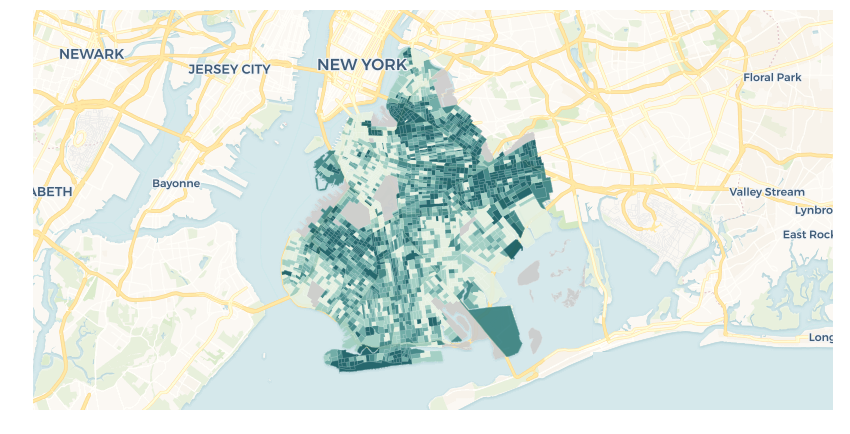
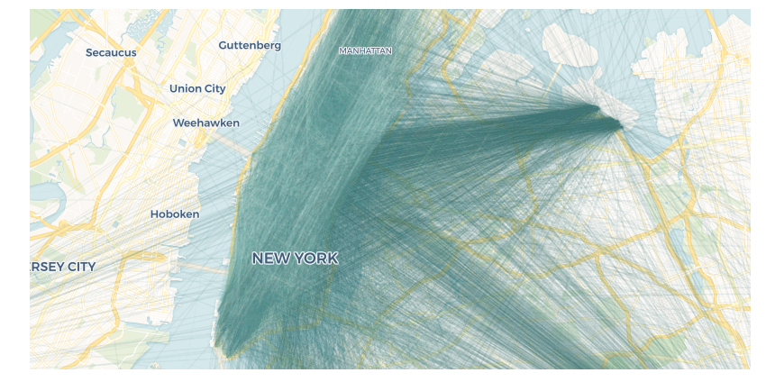

# Example Datasets

cartoframes' example datasets functionality allows users to learn cartoframes features 1) without needing to authenticate against their account, or 2) using pre-packaged data to follow along in notebooks


```python
from cartoframes.examples import example_context
from cartoframes import Layer, QueryLayer
```

## List available tables


```python
[table.name for table in example_context.tables()]
```


    ['mcdonalds_nyc', 'nyc_census_tracts', 'brooklyn_poverty', 'taxi_50k', 'nat']


## Brooklyn Poverty Data


```python
from cartoframes.examples import read_brooklyn_poverty
df = read_brooklyn_poverty()
df.head()
```


<div>
<style scoped>
    .dataframe tbody tr th:only-of-type {
        vertical-align: middle;
    }

    .dataframe tbody tr th {
        vertical-align: top;
    }

    .dataframe thead th {
        text-align: right;
    }
</style>
<table border="1" class="dataframe">
  <thead>
    <tr style="text-align: right;">
      <th></th>
      <th>commuters_16_over_2011_2015</th>
      <th>geoid</th>
      <th>pop_determined_poverty_status_2011_2015</th>
      <th>poverty_count</th>
      <th>poverty_per_pop</th>
      <th>the_geom</th>
      <th>total_pop_2011_2015</th>
      <th>total_population</th>
      <th>walked_to_work_2011_2015_per_pop</th>
    </tr>
    <tr>
      <th>cartodb_id</th>
      <th></th>
      <th></th>
      <th></th>
      <th></th>
      <th></th>
      <th></th>
      <th></th>
      <th></th>
      <th></th>
    </tr>
  </thead>
  <tbody>
    <tr>
      <th>2052</th>
      <td>NaN</td>
      <td>360479901000</td>
      <td>NaN</td>
      <td>NaN</td>
      <td>NaN</td>
      <td>None</td>
      <td>NaN</td>
      <td>0</td>
      <td>NaN</td>
    </tr>
    <tr>
      <th>1606</th>
      <td>0.0</td>
      <td>360470702031</td>
      <td>0.0</td>
      <td>NaN</td>
      <td>NaN</td>
      <td>0106000020E61000000800000001030000000100000013...</td>
      <td>0.0</td>
      <td>0</td>
      <td>NaN</td>
    </tr>
    <tr>
      <th>1572</th>
      <td>NaN</td>
      <td>360470666000</td>
      <td>NaN</td>
      <td>NaN</td>
      <td>NaN</td>
      <td>None</td>
      <td>NaN</td>
      <td>0</td>
      <td>NaN</td>
    </tr>
    <tr>
      <th>17</th>
      <td>5058.0</td>
      <td>360470534004</td>
      <td>23191.0</td>
      <td>377.0</td>
      <td>0.406394</td>
      <td>0106000020E6100000010000000103000000010000000B...</td>
      <td>21451.0</td>
      <td>928</td>
      <td>0.018761</td>
    </tr>
    <tr>
      <th>53</th>
      <td>4230.0</td>
      <td>360470593001</td>
      <td>10804.0</td>
      <td>117.0</td>
      <td>0.098598</td>
      <td>0106000020E6100000010000000103000000010000000E...</td>
      <td>8116.0</td>
      <td>1185</td>
      <td>0.031915</td>
    </tr>
  </tbody>
</table>
</div>


### Sample map

**Note**: The cell below contains a dynamic map that won't render in static renders like [GitHub](https://github.com/CartoDB/cartoframes/blob/master/examples/Example%20Datasets.ipynb), but will render on [nbviewer](https://nbviewer.jupyter.org/github/CartoDB/cartoframes/blob/master/examples/Example%20Datasets.ipynb). If you're viewing the map on a running notebook server, re-run the cell (after running the top cell first) to ensure it renders as an interactive map.


```python
# Interactive map
example_context.map(Layer('brooklyn_poverty', color='poverty_per_pop'))
```


<iframe srcdoc="<!DOCTYPE html>
<html>
  <head>
    <title>Carto</title>
    <meta name='viewport' content='initial-scale=1.0, user-scalable=no' />
    <meta http-equiv='content-type' content='text/html; charset=UTF-8' />
    <link rel='shortcut icon' href='http://cartodb.com/assets/favicon.ico' />

    <style>
     html, body, #map {
       height: 100%;
       padding: 0;
       margin: 0;
     }
     #zoom-center {
       position: absolute;
       right: 0;
       top: 0;
       background-color: rgba(255, 255, 255, 0.7);
       width: 240px;
       z-index: 100;
       padding: 4px;
     }
    </style>

    <link rel='stylesheet' href='https://cartodb-libs.global.ssl.fastly.net/cartodb.js/v3/3.15/themes/css/cartodb.css' />
  </head>
  <body>
    <div id='zoom-center'>
      zoom=<span id='zoom'>4</span>,
      lng=<span id='lon'>No data</span>, lat=<span id='lat'>No data</span>
    </div>
    <div id='map'></div>
    <script src='https://cartodb-libs.global.ssl.fastly.net/cartodb.js/v3/3.15/cartodb.js'></script>

    <script>
     const config  = {&quot;user_name&quot;: &quot;cartoframes&quot;, &quot;maps_api_template&quot;: &quot;https://cartoframes.carto.com&quot;, &quot;sql_api_template&quot;: &quot;https://cartoframes.carto.com&quot;, &quot;tiler_protocol&quot;: &quot;https&quot;, &quot;tiler_domain&quot;: &quot;carto.com&quot;, &quot;tiler_port&quot;: &quot;80&quot;, &quot;type&quot;: &quot;namedmap&quot;, &quot;named_map&quot;: {&quot;name&quot;: &quot;cartoframes_ver20170406_layers1_time0_baseid2_labels1_zoom0&quot;, &quot;params&quot;: {&quot;basemap_url&quot;: &quot;https://{s}.basemaps.cartocdn.com/rastertiles/voyager_nolabels/{z}/{x}/{y}.png&quot;, &quot;cartocss_0&quot;: &quot;#layer {  polygon-fill: ramp([poverty_per_pop], cartocolor(Mint), quantiles(5), >); polygon-opacity: 0.9; polygon-gamma: 0.5; line-color: #FFF; line-width: 0.5; line-opacity: 0.25; line-comp-op: hard-light;}#layer[poverty_per_pop = null] {  polygon-fill: #ccc;}&quot;, &quot;sql_0&quot;: &quot;SELECT * FROM brooklyn_poverty&quot;, &quot;west&quot;: -74.041916, &quot;south&quot;: 40.569596, &quot;east&quot;: -73.833422, &quot;north&quot;: 40.739158}}};
     const bounds  = [[40.739158, -73.833422], [40.569596, -74.041916]];
     const options = {&quot;filter&quot;: [&quot;mapnik&quot;, &quot;torque&quot;], &quot;https&quot;: true};
     var labels_url = 'https://{s}.basemaps.cartocdn.com/rastertiles/voyager_only_labels/{z}/{x}/{y}.png';

     const adjustLongitude = (lng) => (
       lng - ((Math.ceil((lng + 180) / 360) - 1) * 360)
     );
     const map = L.map('map', {
       zoom: 12,
       center: [40.7504, -73.9503],
     });

     if (L.Browser.retina) {
         var basemap = config.named_map.params.basemap_url.replace('.png', '@2x.png');
         labels_url = labels_url.replace('.png', '@2x.png');
     } else {
         var basemap = config.named_map.params.basemap_url;
     }
     L.tileLayer(basemap, {
         attribution: &quot;&copy; <a href=\&quot;http://www.openstreetmap.org/copyright\&quot;>OpenStreetMap</a>&quot;
     }).addTo(map);

     const updateMapInfo = () => {
       $('#zoom').text(map.getZoom());
       $('#lat').text(map.getCenter().lat.toFixed(4));
       $('#lon').text(adjustLongitude(map.getCenter().lng).toFixed(4));
     };

     cartodb.createLayer(map, config, options)
            .addTo(map)
            .done((layer) => {
                // add labels layer
                if (labels_url) {
                    var topPane = L.DomUtil.create('div', 'leaflet-top-pane', map.getPanes().mapPane);
                    var topLayer = new L.tileLayer(labels_url).addTo(map);
                    topPane.appendChild(topLayer.getContainer());
                    topLayer.setZIndex(7);
                 }

                // fit map to bounds
                if (bounds.length) {
                  map.fitBounds(bounds);
                }

                updateMapInfo();
                map.on('move', () => {
                  updateMapInfo();
                });
            })
            .error((err) => {
              console.log('ERROR: ', err);
            });
    </script>

  </body>
</html>
" width="100%" height="400">  Preview image: </iframe>


```python
# Interactive map
example_context.map(
    Layer('brooklyn_poverty', color='poverty_per_pop'),
    interactive=False)
```


    <matplotlib.axes._subplots.AxesSubplot at 0x10c464748>





## Taxi Data


```python
from cartoframes.examples import read_taxi
df = read_taxi()
df.head()
```


<div>
<style scoped>
    .dataframe tbody tr th:only-of-type {
        vertical-align: middle;
    }

    .dataframe tbody tr th {
        vertical-align: top;
    }

    .dataframe thead th {
        text-align: right;
    }
</style>
<table border="1" class="dataframe">
  <thead>
    <tr style="text-align: right;">
      <th></th>
      <th>dropoff_latitude</th>
      <th>dropoff_longitude</th>
      <th>extra</th>
      <th>fare_amount</th>
      <th>improvement_surcharge</th>
      <th>mta_tax</th>
      <th>passenger_count</th>
      <th>payment_type</th>
      <th>pickup_latitude</th>
      <th>pickup_longitude</th>
      <th>ratecodeid</th>
      <th>store_and_fwd_flag</th>
      <th>the_geom</th>
      <th>tip_amount</th>
      <th>tolls_amount</th>
      <th>total_amount</th>
      <th>tpep_dropoff_datetime</th>
      <th>tpep_pickup_datetime</th>
      <th>trip_distance</th>
      <th>vendorid</th>
    </tr>
    <tr>
      <th>cartodb_id</th>
      <th></th>
      <th></th>
      <th></th>
      <th></th>
      <th></th>
      <th></th>
      <th></th>
      <th></th>
      <th></th>
      <th></th>
      <th></th>
      <th></th>
      <th></th>
      <th></th>
      <th></th>
      <th></th>
      <th></th>
      <th></th>
      <th></th>
      <th></th>
    </tr>
  </thead>
  <tbody>
    <tr>
      <th>1</th>
      <td>40.706779</td>
      <td>-74.012383</td>
      <td>0.0</td>
      <td>8.5</td>
      <td>0.3</td>
      <td>0.5</td>
      <td>2</td>
      <td>1</td>
      <td>40.730461</td>
      <td>-74.006706</td>
      <td>1</td>
      <td>False</td>
      <td>None</td>
      <td>1.00</td>
      <td>0.0</td>
      <td>10.30</td>
      <td>2016-05-01 15:00:36</td>
      <td>2016-05-01 14:52:11</td>
      <td>2.08</td>
      <td>2</td>
    </tr>
    <tr>
      <th>2</th>
      <td>40.762779</td>
      <td>-73.973824</td>
      <td>0.0</td>
      <td>13.5</td>
      <td>0.3</td>
      <td>0.5</td>
      <td>1</td>
      <td>1</td>
      <td>40.744125</td>
      <td>-73.924957</td>
      <td>1</td>
      <td>False</td>
      <td>None</td>
      <td>2.00</td>
      <td>0.0</td>
      <td>16.30</td>
      <td>2016-05-01 08:49:02</td>
      <td>2016-05-01 08:34:08</td>
      <td>3.00</td>
      <td>1</td>
    </tr>
    <tr>
      <th>3</th>
      <td>40.740833</td>
      <td>-73.998955</td>
      <td>0.0</td>
      <td>14.5</td>
      <td>0.3</td>
      <td>0.5</td>
      <td>1</td>
      <td>2</td>
      <td>40.748501</td>
      <td>-73.973488</td>
      <td>1</td>
      <td>False</td>
      <td>None</td>
      <td>0.00</td>
      <td>0.0</td>
      <td>15.30</td>
      <td>2016-05-04 10:07:09</td>
      <td>2016-05-04 09:44:40</td>
      <td>2.10</td>
      <td>1</td>
    </tr>
    <tr>
      <th>4</th>
      <td>40.792370</td>
      <td>-73.966362</td>
      <td>0.5</td>
      <td>15.0</td>
      <td>0.3</td>
      <td>0.5</td>
      <td>1</td>
      <td>2</td>
      <td>40.743267</td>
      <td>-73.999786</td>
      <td>1</td>
      <td>False</td>
      <td>None</td>
      <td>0.00</td>
      <td>0.0</td>
      <td>16.30</td>
      <td>2016-05-01 21:05:24</td>
      <td>2016-05-01 20:50:11</td>
      <td>4.41</td>
      <td>2</td>
    </tr>
    <tr>
      <th>5</th>
      <td>40.784939</td>
      <td>-73.956963</td>
      <td>0.0</td>
      <td>19.5</td>
      <td>0.3</td>
      <td>0.5</td>
      <td>2</td>
      <td>1</td>
      <td>40.803360</td>
      <td>-73.963631</td>
      <td>1</td>
      <td>False</td>
      <td>None</td>
      <td>4.06</td>
      <td>0.0</td>
      <td>24.36</td>
      <td>2016-05-02 07:53:53</td>
      <td>2016-05-02 07:26:56</td>
      <td>4.01</td>
      <td>2</td>
    </tr>
  </tbody>
</table>
</div>


To visualize this data, we need to add a column called `the_geom` to visualize. Using `example_context` we can call the `query` method to get the data or `QueryLayer` to visualize on a map.

If we try to map it, we will get an error because this dataset doesn't have explicit geometries.


```python
example_context.map(Layer('taxi_50k'))
```


    ---------------------------------------------------------------------------

    ValueError                                Traceback (most recent call last)

    <ipython-input-7-dbf78c20e820> in <module>()
    ----> 1 example_context.map(Layer('taxi_50k'))


    ~/git/CartoDB/cartoframes/cartoframes/context.py in map(self, layers, interactive, zoom, lat, lng, size, ax)
        913                     for stylecol, coltype in utils.dict_items(resp['fields']):
        914                         layer.style_cols[stylecol] = coltype['type']
    --> 915                 layer.geom_type = self._geom_type(layer)
        916                 if not base_layers:
        917                     geoms.add(layer.geom_type)


    ~/git/CartoDB/cartoframes/cartoframes/context.py in _geom_type(self, source)
       1103                      common_geom=resp['rows'][0]['geom_type']))
       1104         elif resp['total_rows'] == 0:
    -> 1105             raise ValueError('No geometry for layer. Check all layer tables '
       1106                              'and queries to ensure there are geometries.')
       1107         return resp['rows'][0]['geom_type']


    ValueError: No geometry for layer. Check all layer tables and queries to ensure there are geometries.


### Creating a geometry

There are many ways to create geometries from the lng/lat pairs in the taxi dataset. Here we will do a "crow fly" distance (converted from meters to miles) between pickups and drop-offs.


```python
q = '''
SELECT
  *,
  ST_Transform(the_geom, 3857) as the_geom_webmercator,
  ST_Length(the_geom::geography) / 1609 as crow_dist
FROM (
    SELECT
      ST_MakeLine(CDB_LatLng(pickup_latitude, pickup_longitude), CDB_LatLng(dropoff_latitude, dropoff_longitude)) as the_geom,
      cartodb_id,
      fare_amount,
      trip_distance
    FROM taxi_50k
    WHERE pickup_latitude <> 0 and dropoff_latitude <> 0
) as _w
'''
example_context.map(
    QueryLayer(q, color='fare_amount', opacity=0.05),
    zoom=12, lng=-73.9503, lat=40.7504
)
```


<iframe srcdoc="<!DOCTYPE html>
<html>
  <head>
    <title>Carto</title>
    <meta name='viewport' content='initial-scale=1.0, user-scalable=no' />
    <meta http-equiv='content-type' content='text/html; charset=UTF-8' />
    <link rel='shortcut icon' href='http://cartodb.com/assets/favicon.ico' />

    <style>
     html, body, #map {
       height: 100%;
       padding: 0;
       margin: 0;
     }
     #zoom-center {
       position: absolute;
       right: 0;
       top: 0;
       background-color: rgba(255, 255, 255, 0.7);
       width: 240px;
       z-index: 100;
       padding: 4px;
     }
    </style>

    <link rel='stylesheet' href='https://cartodb-libs.global.ssl.fastly.net/cartodb.js/v3/3.15/themes/css/cartodb.css' />
  </head>
  <body>
    <div id='zoom-center'>
      zoom=<span id='zoom'>4</span>,
      lng=<span id='lon'>No data</span>, lat=<span id='lat'>No data</span>
    </div>
    <div id='map'></div>
    <script src='https://cartodb-libs.global.ssl.fastly.net/cartodb.js/v3/3.15/cartodb.js'></script>

    <script>
     const config  = {&quot;user_name&quot;: &quot;cartoframes&quot;, &quot;maps_api_template&quot;: &quot;https://cartoframes.carto.com&quot;, &quot;sql_api_template&quot;: &quot;https://cartoframes.carto.com&quot;, &quot;tiler_protocol&quot;: &quot;https&quot;, &quot;tiler_domain&quot;: &quot;carto.com&quot;, &quot;tiler_port&quot;: &quot;80&quot;, &quot;type&quot;: &quot;namedmap&quot;, &quot;named_map&quot;: {&quot;name&quot;: &quot;cartoframes_ver20170406_layers1_time0_baseid2_labels1_zoom1&quot;, &quot;params&quot;: {&quot;basemap_url&quot;: &quot;https://{s}.basemaps.cartocdn.com/rastertiles/voyager_nolabels/{z}/{x}/{y}.png&quot;, &quot;cartocss_0&quot;: &quot;#layer {  line-width: 1.5; line-color: ramp([fare_amount], cartocolor(Mint), quantiles(5), >); line-opacity: 0.05;}#layer[fare_amount = null] {  line-color: #ccc;}&quot;, &quot;sql_0&quot;: &quot;\nSELECT\n  *,\n  ST_Transform(the_geom, 3857) as the_geom_webmercator,\n  ST_Length(the_geom::geography) / 1609 as crow_dist\nFROM (\n    SELECT\n      ST_MakeLine(CDB_LatLng(pickup_latitude, pickup_longitude), CDB_LatLng(dropoff_latitude, dropoff_longitude)) as the_geom,\n      cartodb_id,\n      fare_amount,\n      trip_distance\n    FROM taxi_50k\n    WHERE pickup_latitude <> 0 and dropoff_latitude <> 0\n) as _w\n&quot;, &quot;zoom&quot;: 12, &quot;lat&quot;: 40.7504, &quot;lng&quot;: -73.9503}}};
     const bounds  = [];
     const options = {&quot;filter&quot;: [&quot;mapnik&quot;, &quot;torque&quot;], &quot;https&quot;: true};
     var labels_url = 'https://{s}.basemaps.cartocdn.com/rastertiles/voyager_only_labels/{z}/{x}/{y}.png';

     const adjustLongitude = (lng) => (
       lng - ((Math.ceil((lng + 180) / 360) - 1) * 360)
     );
     const map = L.map('map', {
       zoom: 12,
       center: [40.7504, -73.9503],
     });

     if (L.Browser.retina) {
         var basemap = config.named_map.params.basemap_url.replace('.png', '@2x.png');
         labels_url = labels_url.replace('.png', '@2x.png');
     } else {
         var basemap = config.named_map.params.basemap_url;
     }
     L.tileLayer(basemap, {
         attribution: &quot;&copy; <a href=\&quot;http://www.openstreetmap.org/copyright\&quot;>OpenStreetMap</a>&quot;
     }).addTo(map);

     const updateMapInfo = () => {
       $('#zoom').text(map.getZoom());
       $('#lat').text(map.getCenter().lat.toFixed(4));
       $('#lon').text(adjustLongitude(map.getCenter().lng).toFixed(4));
     };

     cartodb.createLayer(map, config, options)
            .addTo(map)
            .done((layer) => {
                // add labels layer
                if (labels_url) {
                    var topPane = L.DomUtil.create('div', 'leaflet-top-pane', map.getPanes().mapPane);
                    var topLayer = new L.tileLayer(labels_url).addTo(map);
                    topPane.appendChild(topLayer.getContainer());
                    topLayer.setZIndex(7);
                 }

                // fit map to bounds
                if (bounds.length) {
                  map.fitBounds(bounds);
                }

                updateMapInfo();
                map.on('move', () => {
                  updateMapInfo();
                });
            })
            .error((err) => {
              console.log('ERROR: ', err);
            });
    </script>

  </body>
</html>
" width="100%" height="400">  Preview image: </iframe>


```python
# static view
example_context.map(
    QueryLayer(q, color='fare_amount', opacity=0.05),
    zoom=12, lng=-73.9503, lat=40.7504,
    interactive=False
)
```


    <matplotlib.axes._subplots.AxesSubplot at 0x10c40a2b0>





We can use that same query to get the line geometries, and compare the crow fly distance with the reported distance.


```python
taxi_lines = example_context.query(q)
taxi_lines.head()
```


<div>
<style scoped>
    .dataframe tbody tr th:only-of-type {
        vertical-align: middle;
    }

    .dataframe tbody tr th {
        vertical-align: top;
    }

    .dataframe thead th {
        text-align: right;
    }
</style>
<table border="1" class="dataframe">
  <thead>
    <tr style="text-align: right;">
      <th></th>
      <th>crow_dist</th>
      <th>fare_amount</th>
      <th>the_geom</th>
      <th>trip_distance</th>
    </tr>
    <tr>
      <th>cartodb_id</th>
      <th></th>
      <th></th>
      <th></th>
      <th></th>
    </tr>
  </thead>
  <tbody>
    <tr>
      <th>1</th>
      <td>1.661395</td>
      <td>8.5</td>
      <td>0102000020E610000002000000020000E06D8052C00400...</td>
      <td>2.08</td>
    </tr>
    <tr>
      <th>2</th>
      <td>2.869732</td>
      <td>13.5</td>
      <td>0102000020E610000002000000FEFFFF7F327B52C0FBFF...</td>
      <td>3.00</td>
    </tr>
    <tr>
      <th>3</th>
      <td>1.437734</td>
      <td>14.5</td>
      <td>0102000020E610000002000000000000A04D7E52C0FFFF...</td>
      <td>2.10</td>
    </tr>
    <tr>
      <th>4</th>
      <td>3.815911</td>
      <td>15.0</td>
      <td>0102000020E610000002000000FEFFFF7FFC7F52C00400...</td>
      <td>4.41</td>
    </tr>
    <tr>
      <th>5</th>
      <td>1.318624</td>
      <td>19.5</td>
      <td>0102000020E610000002000000FEFFFF1FAC7D52C00500...</td>
      <td>4.01</td>
    </tr>
  </tbody>
</table>
</div>


## Nat dataset


```python
from cartoframes import styling
example_context.map(Layer('nat', color={'column': 'hr90', 'scheme': styling.sunset(7)}))
```


<iframe srcdoc="<!DOCTYPE html>
<html>
  <head>
    <title>Carto</title>
    <meta name='viewport' content='initial-scale=1.0, user-scalable=no' />
    <meta http-equiv='content-type' content='text/html; charset=UTF-8' />
    <link rel='shortcut icon' href='http://cartodb.com/assets/favicon.ico' />

    <style>
     html, body, #map {
       height: 100%;
       padding: 0;
       margin: 0;
     }
     #zoom-center {
       position: absolute;
       right: 0;
       top: 0;
       background-color: rgba(255, 255, 255, 0.7);
       width: 240px;
       z-index: 100;
       padding: 4px;
     }
    </style>

    <link rel='stylesheet' href='https://cartodb-libs.global.ssl.fastly.net/cartodb.js/v3/3.15/themes/css/cartodb.css' />
  </head>
  <body>
    <div id='zoom-center'>
      zoom=<span id='zoom'>4</span>,
      lng=<span id='lon'>No data</span>, lat=<span id='lat'>No data</span>
    </div>
    <div id='map'></div>
    <script src='https://cartodb-libs.global.ssl.fastly.net/cartodb.js/v3/3.15/cartodb.js'></script>

    <script>
     const config  = {&quot;user_name&quot;: &quot;cartoframes&quot;, &quot;maps_api_template&quot;: &quot;https://cartoframes.carto.com&quot;, &quot;sql_api_template&quot;: &quot;https://cartoframes.carto.com&quot;, &quot;tiler_protocol&quot;: &quot;https&quot;, &quot;tiler_domain&quot;: &quot;carto.com&quot;, &quot;tiler_port&quot;: &quot;80&quot;, &quot;type&quot;: &quot;namedmap&quot;, &quot;named_map&quot;: {&quot;name&quot;: &quot;cartoframes_ver20170406_layers1_time0_baseid2_labels1_zoom0&quot;, &quot;params&quot;: {&quot;basemap_url&quot;: &quot;https://{s}.basemaps.cartocdn.com/rastertiles/voyager_nolabels/{z}/{x}/{y}.png&quot;, &quot;cartocss_0&quot;: &quot;#layer {  polygon-fill: ramp([hr90], cartocolor(Sunset), quantiles(7), >); polygon-opacity: 0.9; polygon-gamma: 0.5; line-color: #FFF; line-width: 0.5; line-opacity: 0.25; line-comp-op: hard-light;}#layer[hr90 = null] {  polygon-fill: #ccc;}&quot;, &quot;sql_0&quot;: &quot;SELECT * FROM nat&quot;, &quot;west&quot;: -124.731422424316, &quot;south&quot;: 24.9559669494629, &quot;east&quot;: -66.9698486328125, &quot;north&quot;: 49.3717346191406}}};
     const bounds  = [[49.3717346191406, -66.9698486328125], [24.9559669494629, -124.731422424316]];
     const options = {&quot;filter&quot;: [&quot;mapnik&quot;, &quot;torque&quot;], &quot;https&quot;: true};
     var labels_url = 'https://{s}.basemaps.cartocdn.com/rastertiles/voyager_only_labels/{z}/{x}/{y}.png';

     const adjustLongitude = (lng) => (
       lng - ((Math.ceil((lng + 180) / 360) - 1) * 360)
     );
     const map = L.map('map', {
       zoom: 3,
       center: [0, 0],
     });

     if (L.Browser.retina) {
         var basemap = config.named_map.params.basemap_url.replace('.png', '@2x.png');
         labels_url = labels_url.replace('.png', '@2x.png');
     } else {
         var basemap = config.named_map.params.basemap_url;
     }
     L.tileLayer(basemap, {
         attribution: &quot;&copy; <a href=\&quot;http://www.openstreetmap.org/copyright\&quot;>OpenStreetMap</a>&quot;
     }).addTo(map);

     const updateMapInfo = () => {
       $('#zoom').text(map.getZoom());
       $('#lat').text(map.getCenter().lat.toFixed(4));
       $('#lon').text(adjustLongitude(map.getCenter().lng).toFixed(4));
     };

     cartodb.createLayer(map, config, options)
            .addTo(map)
            .done((layer) => {
                // add labels layer
                if (labels_url) {
                    var topPane = L.DomUtil.create('div', 'leaflet-top-pane', map.getPanes().mapPane);
                    var topLayer = new L.tileLayer(labels_url).addTo(map);
                    topPane.appendChild(topLayer.getContainer());
                    topLayer.setZIndex(7);
                 }

                // fit map to bounds
                if (bounds.length) {
                  map.fitBounds(bounds);
                }

                updateMapInfo();
                map.on('move', () => {
                  updateMapInfo();
                });
            })
            .error((err) => {
              console.log('ERROR: ', err);
            });
    </script>

  </body>
</html>
" width="100%" height="400">  Preview image: </iframe>
