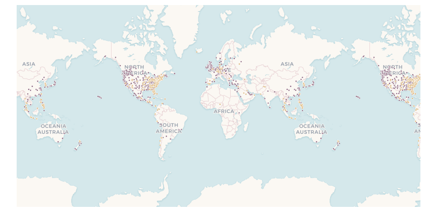

# CARTOframes with Dask

This notebook recreate the workflow from <https://jakevdp.github.io/blog/2015/08/14/out-of-core-dataframes-in-python/>, where the author explores [`dask`](http://dask.pydata.org/en/latest/) for splitting up the computations across multiple cores in a machine to complete tasks more quickly.

## Basics

You'll need the following for this:

1. Your CARTO username
2. Your API key

Paste these values in the quotes (`''`) below.


```python
%matplotlib inline
import pandas as pd
import cartoframes

username = ''   # <-- insert your username here
api_key = ''    # <-- insert your API key here

cc = cartoframes.CartoContext('https://{}.carto.com/'.format(username),
                              api_key)
```


```python
from dask import dataframe as dd
import pandas as pd
columns = ["name", "amenity", "Longitude", "Latitude"]
data = dd.read_csv('scratch/POIWorld.csv', usecols=columns)
```


```python
with_name = data[data.name.notnull()]
with_amenity = data[data.amenity.notnull()]

is_starbucks = with_name.name.str.contains('[Ss]tarbucks')
is_dunkin = with_name.name.str.contains('[Dd]unkin')

starbucks = with_name[is_starbucks].compute()
dunkin = with_name[is_dunkin].compute()
```


```python
starbucks['type'] = 'starbucks'
dunkin['type'] = 'dunkin'
coffee_places = pd.concat([starbucks, dunkin])
coffee_places.head(20)
```


<div>
<style scoped>
    .dataframe tbody tr th:only-of-type {
        vertical-align: middle;
    }

    .dataframe tbody tr th {
        vertical-align: top;
    }

    .dataframe thead th {
        text-align: right;
    }
</style>
<table border="1" class="dataframe">
  <thead>
    <tr style="text-align: right;">
      <th></th>
      <th>name</th>
      <th>amenity</th>
      <th>Longitude</th>
      <th>Latitude</th>
      <th>type</th>
    </tr>
  </thead>
  <tbody>
    <tr>
      <th>6696</th>
      <td>Starbucks</td>
      <td>cafe</td>
      <td>121.035006</td>
      <td>14.547281</td>
      <td>starbucks</td>
    </tr>
    <tr>
      <th>8322</th>
      <td>Starbucks Coffee</td>
      <td>cafe</td>
      <td>120.978371</td>
      <td>14.578929</td>
      <td>starbucks</td>
    </tr>
    <tr>
      <th>9505</th>
      <td>星巴克咖啡 Starbucks</td>
      <td>cafe</td>
      <td>120.135887</td>
      <td>30.271254</td>
      <td>starbucks</td>
    </tr>
    <tr>
      <th>12417</th>
      <td>星巴克咖啡 Starbucks</td>
      <td>cafe</td>
      <td>120.158464</td>
      <td>30.253061</td>
      <td>starbucks</td>
    </tr>
    <tr>
      <th>12418</th>
      <td>星巴克咖啡 Starbucks</td>
      <td>cafe</td>
      <td>120.157341</td>
      <td>30.256555</td>
      <td>starbucks</td>
    </tr>
    <tr>
      <th>28564</th>
      <td>Starbucks</td>
      <td>cafe</td>
      <td>-76.934625</td>
      <td>40.238707</td>
      <td>starbucks</td>
    </tr>
    <tr>
      <th>33017</th>
      <td>Starbucks</td>
      <td>cafe</td>
      <td>-1.545032</td>
      <td>53.797463</td>
      <td>starbucks</td>
    </tr>
    <tr>
      <th>36552</th>
      <td>Starbucks Coffee</td>
      <td>cafe</td>
      <td>-79.390940</td>
      <td>43.649976</td>
      <td>starbucks</td>
    </tr>
    <tr>
      <th>37719</th>
      <td>Starbucks Coffee</td>
      <td>cafe</td>
      <td>-79.389462</td>
      <td>43.645361</td>
      <td>starbucks</td>
    </tr>
    <tr>
      <th>40437</th>
      <td>Starbucks Coffee</td>
      <td>cafe</td>
      <td>-79.393634</td>
      <td>43.670435</td>
      <td>starbucks</td>
    </tr>
    <tr>
      <th>40439</th>
      <td>Starbucks Coffee</td>
      <td>cafe</td>
      <td>-79.390089</td>
      <td>43.670596</td>
      <td>starbucks</td>
    </tr>
    <tr>
      <th>41495</th>
      <td>Starbucks Coffee</td>
      <td>cafe</td>
      <td>13.388738</td>
      <td>52.519403</td>
      <td>starbucks</td>
    </tr>
    <tr>
      <th>41500</th>
      <td>Starbucks Coffee</td>
      <td>cafe</td>
      <td>13.379787</td>
      <td>52.516727</td>
      <td>starbucks</td>
    </tr>
    <tr>
      <th>41869</th>
      <td>Starbucks Coffee</td>
      <td>cafe</td>
      <td>13.373732</td>
      <td>52.507931</td>
      <td>starbucks</td>
    </tr>
    <tr>
      <th>42941</th>
      <td>Starbucks Coffee</td>
      <td>cafe</td>
      <td>13.376430</td>
      <td>52.510587</td>
      <td>starbucks</td>
    </tr>
    <tr>
      <th>43173</th>
      <td>Starbucks</td>
      <td>cafe</td>
      <td>32.878538</td>
      <td>39.895229</td>
      <td>starbucks</td>
    </tr>
    <tr>
      <th>43229</th>
      <td>Starbucks</td>
      <td>cafe</td>
      <td>16.370443</td>
      <td>48.203665</td>
      <td>starbucks</td>
    </tr>
    <tr>
      <th>45342</th>
      <td>Starbucks</td>
      <td>cafe</td>
      <td>13.390018</td>
      <td>52.511072</td>
      <td>starbucks</td>
    </tr>
    <tr>
      <th>50742</th>
      <td>Starbucks Coffee</td>
      <td>cafe</td>
      <td>-79.385434</td>
      <td>43.655530</td>
      <td>starbucks</td>
    </tr>
    <tr>
      <th>53643</th>
      <td>Starbucks Coffee</td>
      <td>cafe</td>
      <td>-0.135514</td>
      <td>51.498925</td>
      <td>starbucks</td>
    </tr>
  </tbody>
</table>
</div>


## Write DataFrame to CARTO


```python
# specify columns for lng/lat so carto will create a geometry
cc.write(coffee_places,
         table_name='coffee_places',
         lnglat=('longitude', 'latitude'),
         overwrite=True)
```

    The following columns were changed in the CARTO copy of this dataframe:
    Longitude -> longitude
    Latitude -> latitude
    Table successfully written to CARTO: https://cartoframes.carto.com/dataset/coffee_places


### Let's visualize this DataFrame

Category map on Dunkin' Donuts vs. Starbucks (aka, color by 'type')


```python
from cartoframes import Layer
cc.map(layers=Layer('coffee_places', color='type', size=3))
```


    <matplotlib.axes._subplots.AxesSubplot at 0x160fe00f0>





## Fast Food


```python
is_fastfood = with_amenity.amenity.str.contains('fast_food')
fastfood = with_amenity[is_fastfood]
fastfood.name.value_counts().head(12)
```


    McDonald's        8697
    Subway            7058
    Burger King       3226
    KFC               2881
    Wendy's           1304
    Taco Bell         1282
    Pizza Hut         1014
    マクドナルド             927
    Dairy Queen        745
    Domino's Pizza     724
    McDonalds          619
    Arby's             609
    Name: name, dtype: int64


```python
ff = fastfood.compute()
cc.write(ff,
         table_name='fastfood_dask',
         lnglat=('longitude', 'latitude'), overwrite=True)
```

    The following columns were changed in the CARTO copy of this dataframe:
    Longitude -> longitude
    Latitude -> latitude
    Table successfully written to CARTO: https://cartoframes.carto.com/dataset/fastfood_dask
    `the_geom` column is being populated from `('longitude', 'latitude')`. Check the status of the operation with:
        BatchJobStatus(CartoContext(), 'd2bc4e92-b1d5-4c7d-a8d7-d5a47eddea0f').status()
    or try reading the table from CARTO in a couple of minutes.
    Note: `CartoContext.map` will not work on this table until its geometries are created.


    BatchJobStatus(job_id='d2bc4e92-b1d5-4c7d-a8d7-d5a47eddea0f', last_status='pending', created_at='2017-12-05T14:25:06.748Z')


### Number of Fast Food places in this OSM dump


```python
len(ff)
```


    152214


### OSM Fast Food POIs


```python
from cartoframes import BaseMap
cc.map(layers=Layer('fastfood_dask', size=2))
```


<iframe srcdoc="<!DOCTYPE html>
<html>
  <head>
    <title>Carto</title>
    <meta name='viewport' content='initial-scale=1.0, user-scalable=no' />
    <meta http-equiv='content-type' content='text/html; charset=UTF-8' />
    <link rel='shortcut icon' href='http://cartodb.com/assets/favicon.ico' />

    <style>
     html, body, #map {
       height: 100%;
       padding: 0;
       margin: 0;
     }
     #zoom-center {
       position: absolute;
       right: 0;
       top: 0;
       background-color: rgba(255, 255, 255, 0.7);
       width: 240px;
       z-index: 100;
       padding: 4px;
     }
    </style>

    <link rel='stylesheet' href='https://cartodb-libs.global.ssl.fastly.net/cartodb.js/v3/3.15/themes/css/cartodb.css' />
  </head>
  <body>
    <div id='zoom-center'>
      zoom=<span id='zoom'>4</span>,
      lng=<span id='lon'>No data</span>, lat=<span id='lat'>No data</span>
    </div>
    <div id='map'></div>
    <script src='https://cartodb-libs.global.ssl.fastly.net/cartodb.js/v3/3.15/cartodb.js'></script>

    <script>
     const config  = {&quot;copy;user_name&quot;: &quot;cartoframes&quot;, &quot;maps_api_template&quot;: &quot;https://cartoframes.carto.com&quot;, &quot;sql_api_template&quot;: &quot;https://cartoframes.carto.com&quot;, &quot;tiler_protocol&quot;: &quot;https&quot;, &quot;tiler_domain&quot;: &quot;carto.com&quot;, &quot;tiler_port&quot;: &quot;80&quot;, &quot;type&quot;: &quot;namedmap&quot;, &quot;named_map&quot;: {&quot;name&quot;: &quot;cartoframes_ver20170406_layers1_time0_baseid2_labels0_zoom0&quot;, &quot;params&quot;: {&quot;basemap_url&quot;: &quot;https://cartodb-basemaps-{s}.global.ssl.fastly.net/rastertiles/voyager_labels_under/{z}/{x}/{y}.png&quot;, &quot;cartocss_0&quot;: &quot;#layer[&#92;'mapnik::geometry_type&#92;'=1] {  marker-width: 2; marker-fill: #5D69B1; marker-fill-opacity: 1; marker-allow-overlap: true; marker-line-width: 0.5; marker-line-color: #FFF; marker-line-opacity: 1;} #layer[&#92;'mapnik::geometry_type&#92;'=2] {  line-width: 1.5; line-color: #5D69B1;} #layer[&#92;'mapnik::geometry_type&#92;'=3] {  polygon-fill: #5D69B1; polygon-opacity: 0.9; polygon-gamma: 0.5; line-color: #FFF; line-width: 0.5; line-opacity: 0.25; line-comp-op: hard-light;} &quot;, &quot;sql_0&quot;: &quot;SELECT * FROM fastfood_dask&quot;, &quot;west&quot;: -178.8312024, &quot;south&quot;: -54.8071336, &quot;east&quot;: 178.4835648, &quot;north&quot;: 71.6361881}}};
     const bounds  = [[71.6361881, 178.4835648], [-54.8071336, -178.8312024]];
     const options = {&quot;filter&quot;: [&quot;mapnik&quot;, &quot;torque&quot;], &quot;https&quot;: true};

     const adjustLongitude = (lng) => (
       lng - ((Math.ceil((lng + 180) / 360) - 1) * 360)
     );
     const map = L.map('map', {
       zoom: 3,
       center: [0, 0],
     });

     if (L.Browser.retina) {
         var basemap = config.named_map.params.basemap_url.replace('.png', '@2x.png');
     } else {
         var basemap = config.named_map.params.basemap_url;
     }
     L.tileLayer(basemap, {
         attribution: &quot;&copy; <a href=\&quot;http://www.openstreetmap.org/copyright\&quot;>OpenStreetMap</a>&quot;
     }).addTo(map);
     const updateMapInfo = () => {
       $('#zoom').text(map.getZoom());
       $('#lat').text(map.getCenter().lat.toFixed(4));
       $('#lon').text(adjustLongitude(map.getCenter().lng).toFixed(4));
     };

     cartodb.createLayer(map, config, options)
            .addTo(map)
            .done((layer) => {
              if (bounds.length) {
                map.fitBounds(bounds);
              }
              updateMapInfo();
              map.on('move', () => {
                updateMapInfo();
              });
            })
            .error((err) => {
              console.log('ERROR: ', err);
            });
    </script>

  </body>
</html>
" width="100%" height="400">  Preview image: </iframe>


### Adding measures from the Data Observatory

We can augment our datasets to find out some demographics at the areas of each of the coffee places if you wanted to add features for building a model.


```python
# DO measures: Total Population,
#              Children under 18 years of age
#              Median income

data_obs_measures = [{'numer_id': 'us.census.acs.B01003001'},
                     {'numer_id': 'us.census.acs.B17001001'},
                     {'numer_id': 'us.census.acs.B19013001'}]
coffee_augmented = cc.data('coffee_places', data_obs_measures)
coffee_augmented.head()
```


<div>
<style scoped>
    .dataframe tbody tr th:only-of-type {
        vertical-align: middle;
    }

    .dataframe tbody tr th {
        vertical-align: top;
    }

    .dataframe thead th {
        text-align: right;
    }
</style>
<table border="1" class="dataframe">
  <thead>
    <tr style="text-align: right;">
      <th></th>
      <th>amenity</th>
      <th>index</th>
      <th>latitude</th>
      <th>longitude</th>
      <th>median_income_2010_2014</th>
      <th>median_income_2011_2015</th>
      <th>name</th>
      <th>pop_determined_poverty_status_per_sq_km_2010_2014</th>
      <th>pop_determined_poverty_status_per_sq_km_2011_2015</th>
      <th>the_geom</th>
      <th>total_pop_per_sq_km_2010_2014</th>
      <th>total_pop_per_sq_km_2011_2015</th>
      <th>type</th>
    </tr>
    <tr>
      <th>cartodb_id</th>
      <th></th>
      <th></th>
      <th></th>
      <th></th>
      <th></th>
      <th></th>
      <th></th>
      <th></th>
      <th></th>
      <th></th>
      <th></th>
      <th></th>
      <th></th>
    </tr>
  </thead>
  <tbody>
    <tr>
      <th>6</th>
      <td>cafe</td>
      <td>28564</td>
      <td>40.238707</td>
      <td>-76.934625</td>
      <td>62842.0</td>
      <td>63415.0</td>
      <td>Starbucks</td>
      <td>881.868363</td>
      <td>873.056479</td>
      <td>0101000020E61000007D2079E7D03B53C005EBEEF08D1E...</td>
      <td>996.366180</td>
      <td>991.577729</td>
      <td>starbucks</td>
    </tr>
    <tr>
      <th>26</th>
      <td>cafe</td>
      <td>65532</td>
      <td>35.079845</td>
      <td>-106.606866</td>
      <td>34140.0</td>
      <td>32838.0</td>
      <td>Starbucks</td>
      <td>869.520635</td>
      <td>871.745312</td>
      <td>0101000020E61000001CA43BE3D6A65AC0A11EEC5E388A...</td>
      <td>929.112813</td>
      <td>932.249243</td>
      <td>starbucks</td>
    </tr>
    <tr>
      <th>42</th>
      <td>cafe</td>
      <td>93071</td>
      <td>44.039946</td>
      <td>-88.541166</td>
      <td>39996.0</td>
      <td>40665.0</td>
      <td>Starbucks</td>
      <td>687.264493</td>
      <td>686.831843</td>
      <td>0101000020E61000004E0E9F74A22256C092CD55F31C05...</td>
      <td>854.267385</td>
      <td>840.552380</td>
      <td>starbucks</td>
    </tr>
    <tr>
      <th>61</th>
      <td>cafe</td>
      <td>143097</td>
      <td>37.367685</td>
      <td>-122.036460</td>
      <td>122354.0</td>
      <td>125488.0</td>
      <td>Starbucks</td>
      <td>3211.407801</td>
      <td>3278.440419</td>
      <td>0101000020E6100000CFC7105B55825EC0D45D7E4C10AF...</td>
      <td>3238.971520</td>
      <td>3308.291340</td>
      <td>starbucks</td>
    </tr>
    <tr>
      <th>69</th>
      <td>cafe</td>
      <td>169680</td>
      <td>39.953015</td>
      <td>-75.192289</td>
      <td>18933.0</td>
      <td>20483.0</td>
      <td>Starbucks</td>
      <td>4855.675567</td>
      <td>4977.608287</td>
      <td>0101000020E610000067B96C744ECC52C0910E0F61FCF9...</td>
      <td>6558.800331</td>
      <td>6725.720324</td>
      <td>starbucks</td>
    </tr>
  </tbody>
</table>
</div>
