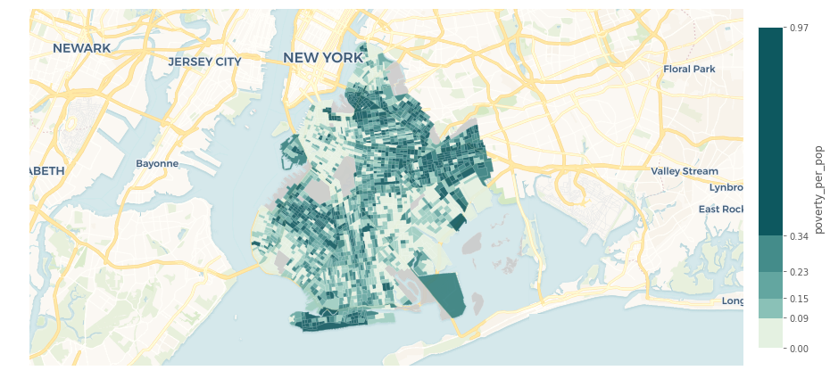

## Quickstart Guide

### About this guide

This guide gets you set up with cartoframes by installing cartoframes, working in a Jupyter notebook, reading data from CARTO into your Python session, writing data to your CARTO account, and visualizing the data.

### Installing CARTOframes

You can install CARTOframes with `pip`. Simply type the following in the command line to do a system install:

```bash
$ pip install cartoframes
```
To install through a Jupyter notebook, you can run

```bash
!pip install cartoframes
```

It is recommended to install cartoframes in a [virtual environment](http://docs.python-guide.org/en/latest/dev/virtualenvs/). For example, you can run the the following command line commands to create a virtual env, activate it, and install cartoframes:

```bash
$ virtualenv cfenv
$ source cfenv/bin/activate
(cfenv) $ pip install cartoframes
```

You'll notice the virtual environment name in your command line prompt, like above. Type `deactivate` to exit the virtualenv:

```bash
(cfenv) $ deactivate
```

### Installing Jupyter notebook

To install Jupyter, type:

```bash
$ pip install jupyter
```

If working in a virtual environment, make sure you have activated the environment first.

### Starting Jupyter notebook

Start up a Jupyter notebook with the following command:

```bash
$ jupyter notebook
```

After you type that command, you will see the notebook server starting up and a browser window with the directory contents open.

Next, create a new notebook. See Jupyter's [running a notebook](https://jupyter.readthedocs.io/en/latest/running.html#running) for more information.

### Authentication

Before we can do anything with CARTOframes, we need to authenticate against a CARTO account by passing in CARTO credentials. You will need your username and API keys, which can be found at `http://your_user_name.carto.com/your_apps`.

There are two methods of authentication:

1. Setting the `base_url` and `api_key` directly in CartoContext

```python
cc = CartoContext(
    base_url='https://<your_user_name>.carto.com',
    api_key='<your_api_key>')
```

2. By passing a Credentials instance in CartoContext’s creds keyword argument.

```python
from cartoframes import Credentials, CartoContext
creds = Credentials(username='<your_user_name>', key='<your_api_key>')
cc = CartoContext(creds=creds)
```

You can also save your credentials to use later, independent of the Python session. Your credentials will be saved locally on your machine for future sessions.

```python
from cartoframes import Credentials, CartoContext
creds = Credentials(username='<your_user_name>', key='<your_api_key>')
creds.save()  # save credentials for later use (not dependent on Python session)
```

Once your credientials are saved, you can start using CARTOframes more quickly:

```python
from cartoframes import CartoContext
cc = CartoContext()  # automatically loads credentials if previously saved
```

### Reading a table from CARTO

In this section, you will read a table from your CARTO account into your Python environment as a pandas DataFrame. If you don't already have a table in your account that you want to use, you can send a dataset on poverty rates in Brooklyn, New York to your account with the following code:

```python
from cartoframes.examples import read_brooklyn_poverty
cc.write(read_brooklyn_poverty(), 'brooklyn_poverty')
```

To get your table from CARTO, use the `CartoContext.read` method:

```python
# read a table from your CARTO account to a DataFrame
df = cc.read('brooklyn_poverty')
```

This pulls down the table `brooklyn_poverty` from your CARTO account into a pandas DataFrame. The data types of the SQL table are copied over to the DataFrame and the index is `cartodb_id`. To decode the geometries into [Shapely geometries](https://toblerity.org/shapely/project.html), use the `decode_geom=True` flag.

Now that the data is in a DataFrame, you can use it just as a normal pandas DataFrame.

```python
# do fancy pandas operations (add/drop columns, change values, etc.)
df['poverty_per_pop'] = df['poverty_count'] / df['total_population']
```


### Writing a table to CARTO

To write a table to CARTO, use the `CartoContext.write` method as below:

```python
cc.write(df, 'brooklyn_poverty_w_rates')
```

If the table already exists and you'd like to overwrite it, use the `overwrite=True` flag like so:

```python
cc.write(df, 'brooklyn_poverty', overwrite=True)
```

### Visualizing your table

Now that you have a table in your account, you can visualize it using the `CartoContext.map` method.

This creates an interactive map with only a basemap:

```python
cc.map()
```

To add a data layer, import the `Layer` class and pass it as an argument. We can go further and style by the `poverty_per_pop` column to visualize based on a numeric value.

```python
from cartoframes import Layer
cc.map(layers=Layer('brooklyn_poverty_w_rates', color='poverty_per_pop'))
```



Note: Legends are not yet implemented for stable releases of cartoframes. See [this pull request](https://github.com/CartoDB/cartoframes/pull/184) for more information.
