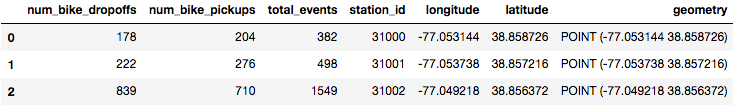
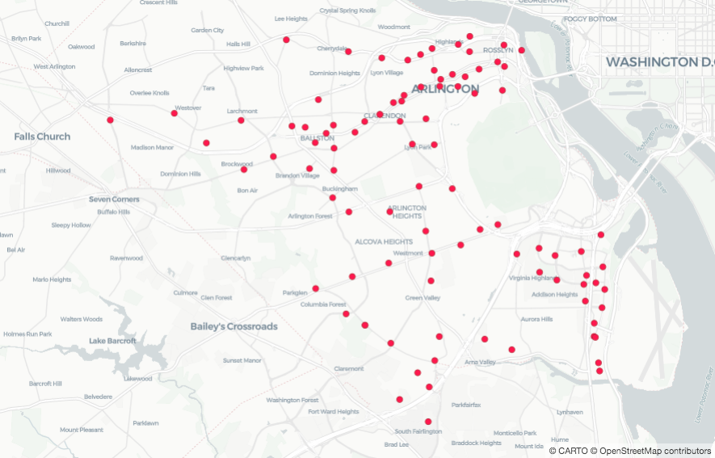
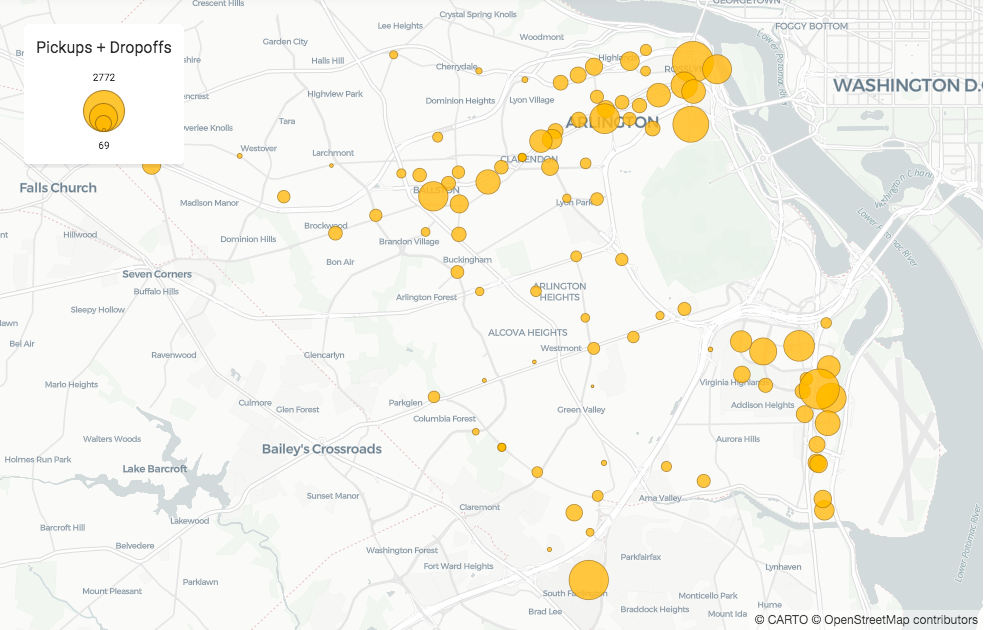

## Quickstart Part 1

Hi! Glad to see you made it to the Quickstart Guide! In this guide you are introduced to how CARTOframes can be used by data scientists in spatial analysis workflows. Using bike share data, this guide walks through some common steps a data scientist takes to answer the following question: **are the company's bike share stations placed in optimal locations?**

Before you get started, we encourage you to have [your environment ready](/developers/cartoframes/guides/Install-CARTOframes-in-your-Notebooks) so you can get a feel for the library by using it. If you don’t have your environment set-up yet, check out this guide first. You will need:

- A Python Notebook environment
- The CARTOframes library installed

### Spatial analysis scenario

Let's say you work for a bike share company in Arlington, Virginia and you want to better understand how your stations around the city are being used, and if these stations are placed in optimal locations.

To begin, let's outline a workflow: 

- Explore your company's data
- Discover and enrich data thanks to the CARTO catalog
- Analyse if the current bike stations are placed in optimal locations
- And finally, share the results of your analysis with your team

Let's get started!

### Explore your company's data

You will be using [this dataset](https://github.com/CartoDB/cartoframes/tree/develop/docs/developer-center/guides/quickstart/arlington_bikeshare_july_agg.geojson) in [GeoJSON](https://geojson.org) format to start your exploration. It contains information about the bike stations around the city of Arlington. As a first exploratory step, you read it into a Jupyter Notebook using a [Geopandas GeoDataframe](http://geopandas.org/reference/geopandas.GeoDataFrame.html).

```py
import geopandas as gpd

arlington_file = 'arlington_bikeshare_july_agg.geojson'
bikeshare_df = gpd.read_file(arlington_file)
bikeshare_df.head(3)
```



By only reading the data into a geodataframe you aren't able to see at a glance where the stations are. So let's visualize it in a map!

> Note: In case your data hasn't been geocoded before, you can do it thanks to our Location Data Services. Learn how to geocode your data reading the [Data Services reference](/developers/cartoframes/reference/#heading-Data-Services).

You can visualize your geodataframes using the Map and Layer classes. You can take a look at our [reference section](/developers/cartoframes/reference/) or check the [visualization examples](/developers/cartoframes/examples/) to know all the visualization possibilities and which data sources are supported.

```py
from cartoframes.viz import Map, Layer

Map(Layer(bikeshare_df))
```



Great! We have a map!

Now, that you have a better sense of about where the stations are located, it's time to continue with the exploration. The next question to answer is which stations around the city are most active. To visualize this on the map, you can use a CARTOframes layer helper. Using the column `total_events`, which is the number of dropoffs and pickups at each station for the past month, let’s try a visualization helper called `size_continuous_layer` to size each station by that value:

```py
from cartoframes.viz.helpers import size_continuous_layer

Map(size_continuous_layer(bikeshare_df, 'total_events'))
```



Good job! Now, just taking a look, you can see where are the stations with more activity. Also, thanks to be using a helper, we get a legend out of it.

To learn more about visualizating your data, about how to add legends, pop-ups, widgets and how to do it faster thanks to helpers, check the [visualization examples](/developers/cartoframes/examples/#example-add-default-widget).

Now, let's add another legend with the census polygons:

```py
census_track = 'census_track.geojson'
census_track_df = gpd.read_file(census_track)

Map(Layer(census_track_df))
```

And finally, let's combine both layers in the same visualization:

```py
Map([
    Layer(census_track_df),
    size_continuous_layer(bikeshare_df, 'total_events', widget=True)
])
```