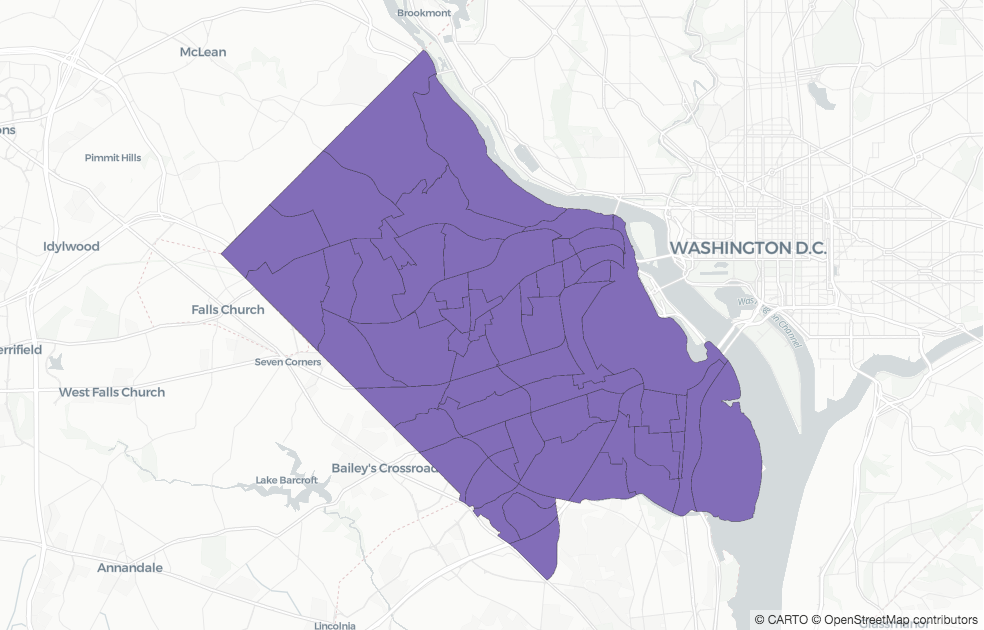
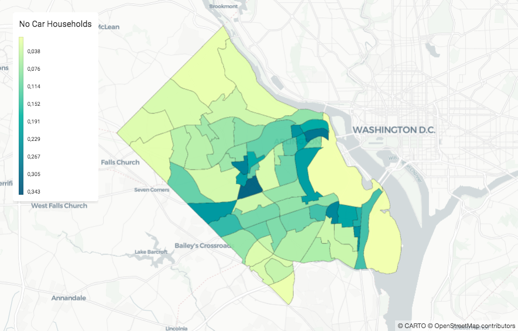
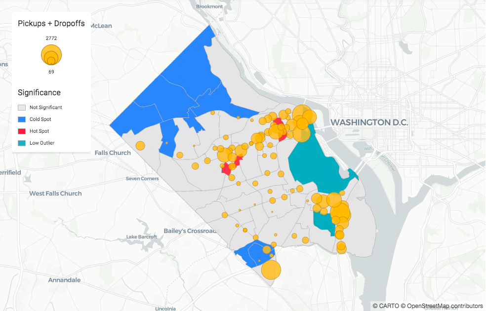
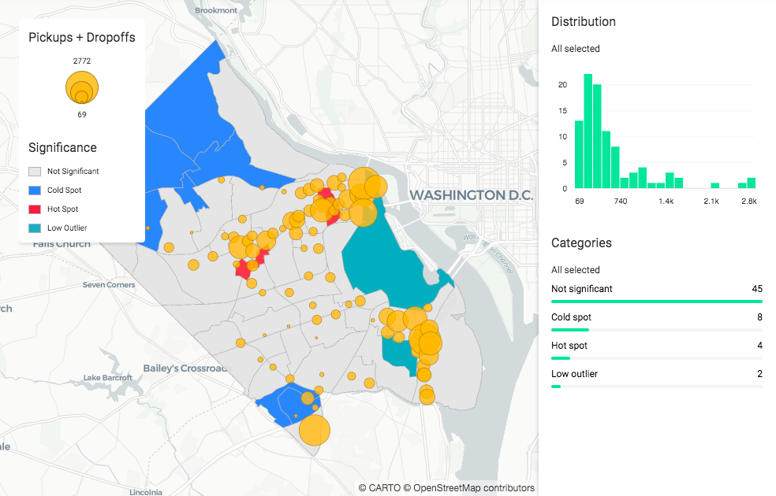
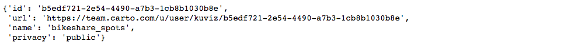

## Quickstart Part 2

This is the second part of the [Quickstart Guide](/developers/cartoframes/guides/#Quickstart-Part-1), where you've learned how to import data and visualize it with CARTOframes. Now, let's discover and enrich your data.

To be able to do so, you have to log in to CARTO. You will need to create an API key and use the method `set_default_credentials` to create a session. If you haven't created an API key yet, check the [authentication reference](/developers/cartoframes/reference/#heading-Authentication) to learn how to get it.

Note: If you don't have an account yet, you can get a [free account](https://carto.com/help/getting-started/student-accounts/) if you are a student or [get a trial](https://carto.com/signup/) if you aren't.

```py
from cartoframes.auth import set_default_credentials

set_default_credentials(username='your_username', api_key='your_api_key')
```

### Discover and enrich data thanks to the CARTO catalog

You already know where your company stations are and their activity, now you want to know if they are in optimal locations. You start thinking about which data could be valuable to validate that and decide to check if there can be any correlation with households with no car data. Let's see how CARTOframes can help you finding that data and enrich yours.

First, we will use the CARTO [data observatory](/developers/cartoframes/reference/#heading-Data-Observatory) to discover the data we want, data about **households** with **no cars.**

For this, we'll get the USA datasets:

```py
from cartoframes.data.observatory.catalog import Catalog
from cartoframes.data import enrichment

countries = Catalog().countries()
usa_datasets = countries.get("usa").datasets()
usa_datasets
```

You'll get something similar to:

```
[<CatalogDataset('ags_businesscou_a8310a11')>,
 <CatalogDataset('ags_consumerpro_e8344e2e')>,
 <CatalogDataset('ags_consumerspe_fe5d060a')>,
 <CatalogDataset('ags_crimerisk_9ec89442')>,
 ...
 <CatalogDataset('od_zillow_a16d6e3e')>,
 <CatalogDataset('od_zillow_2a2349f8')>,
 <CatalogDataset('od_zillow_b32a1842')>,
 <CatalogDataset('tt_trafficdens_c451dfb9')>]
```

In order to get the **households** with **no cars** data, you've look for the USA datasets that contain this particular information, and depending on the data you're looking for you'd have to use one method or another. In this case, we're going to look for the first dataset that has a variable which contains `no_cars` substring in its **id.**

```py
no_cars_variables = None

for dataset in usa_datasets:
    df = dataset.variables.to_dataframe()
    variables = df[df['id'].str.contains('no_cars')]
    
    if variables.size:
        no_cars_variables = variables
        break

no_cars_variables
```

Now that we have found the data we were looking for, let's filter out our area of intereset, Arlington. To do that, first we need to load Arlington's boundaries (they can be found [here](https://gisdata-arlgis.opendata.arcgis.com/datasets/census-tract-2010-polygons?geometry=-77.761%2C38.787%2C-76.772%2C38.974)):

```py
census_track = 'census_track.geojson'
arlington_census_track_df = gpd.read_file(census_track)
arlington_census_track_df.head(3)
```



Let's enrich the Arlington tracts with the households with no car data and visualize them with another layer helper, the `color_continuous_layer`:

```py
from cartoframes.data import enrichment

arlington_no_car_df = enrichment.enrich_polygons(
    arlington_census_track_df,
    household_no_cars_variables,
    agg_operators='SUM'
)

arlington_no_car_df.head()
```

```py
from cartoframes.viz import Map
from cartoframes.viz.helpers import color_continuous_layer

Map(color_continuous_layer(arlington_no_car_df, value='no_car', title='No cars households'))
```



Nice! Thanks to our layer helper, we can already see which are the areas with the highest percentage of households with no cars.

### Bonus: Analyse if the current bike stations are placed in optimal locations

We can already suggest which are the areas where can make more sense to have a station looking at the ones that have more households with no cars. In this step, let's try to go a bit further and try to calculate which areas have significantly high or low numbers of them. We will use the open source library [pySAL](https://pysal.org) for that.

You decide to use [Moran's I](https://pysal.readthedocs.io/en/v1.11.0/users/tutorials/autocorrelation.html#moran-s-i) to measure the spatial autocorrelation and [Queen](https://libpysal.readthedocs.io/en/latest/generated/libpysal.weights.Queen.html) as the algorithm to decide which areas are considered neighbours. Once you are done with your analysis (here we are just showing a simplified version of it), you assign a label with the significance level to each station.

```py
from libpysal.weights import Queen
from pysal.explore.esda.moran import Moran_Local

wq = Queen.from_dataframe(arlington_no_car_df)
wq.transform = 'r'
li = Moran_Local(arlington_no_car_df['no_cars_2011_2015_by_households'], wq)
significance = 1 * (li.p_sim < 0.05)
spot_qs = [1, 3, 2, 4] # HH(hotspot), LL(coldspot), LH(doughnut), HL(diamond)
spots = sum([i * (significance * li.q==i) for i in spot_qs])

spot_labels = ['Not significant', 'Hot spot', 'Low outlier', 'Cold spot', 'Hot outlier']
labels = [spot_labels[i] for i in spots]
arlington_no_car_df = arlington_no_car_df.assign(labels=labels)
```

You have finished your analysis and now you want to see the results in a map, 
plotting the significance of each area. Let's do it!	

```py
from cartoframes.viz.helpers import color_category_layer

arlington_no_car_layer = color_category_layer(
    arlington_no_car_df,
    'labels',
    title='Significance',
    palette=['#E4E4E4','#1785FB', '#F24440', '#12A2B8'],
    stroke_color='#B5B5B5'
)

arlington_bikeshare_layer = size_continuous_layer(
    bikeshare_df,
    'total_events',
    title='Pickups + Dropoffs'
)

Map([arlington_no_car_layer, arlington_bikeshare_layer])
```



Awesome! You have finished with your analysis and see that your company has done a good job placing the stations.

### Publish and share your results

To finish your work, you want to share the results with some teammates. Also, it would be great if you could allow them to play with the information. Let's do that!

First, you have to upload the data used by your maps to CARTO using the `Dataset` class:

```py
from cartoframes.data import Dataset

Dataset(arlington_no_car_df).upload(table_name='arlington_ct_no_cars', credentials=creds, if_exists='replace')
Dataset(bikeshare_df).upload(table_name='bikeshare_july_agg', credentials=creds, if_exists='replace')
```

Now, let's add widgets so people are able to see some graphs about the information displayed and allow them to filter it. To do this, we only have to add `widget=True` to the helpers.

```py
final_map = Map([
    color_category_layer('arlington_ct_no_cars', 'cl', title='Significance', palette=hmap, stroke_color='#B5B5B5', widget=True),
    size_continuous_layer('bikeshare_july_agg', 'total_events', 'Pickups + Dropoffs', widget=True)
])
final_map
```



Cool! Now that you have a small dashboard to play with, let's publish it to CARTO so you are able to share it with anyone. To do this, you just need to call the [publish](/developers/cartoframes/examples/#example-publish-public-visualization) method from the `Map` class:

```py
final_map.publish('bikeshare_spots')
```



Congratulations! You have finished this guide and have a sense about how CARTOframes can speed up your workflow. To continue learning, you can check the specific guides, check the [reference](/developers/cartoframes/reference/) to know everything about a class or a method or check the notebook [examples](/developers/cartoframes/examples/).