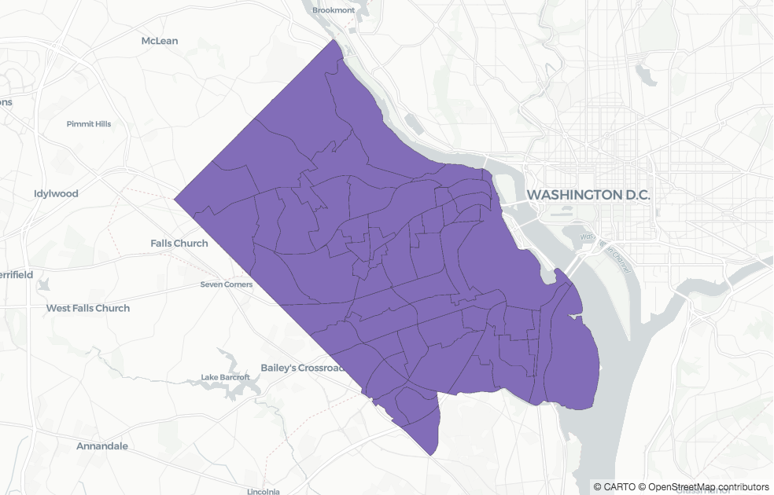
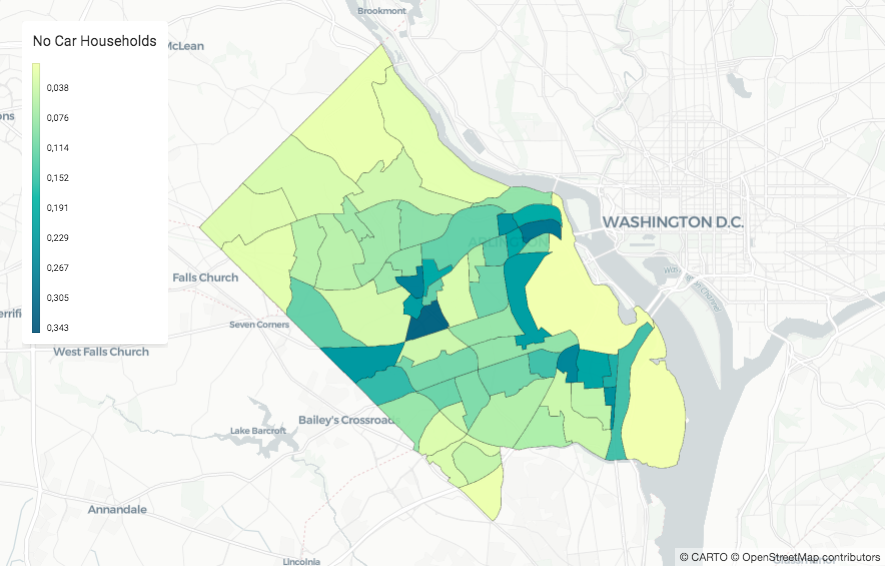
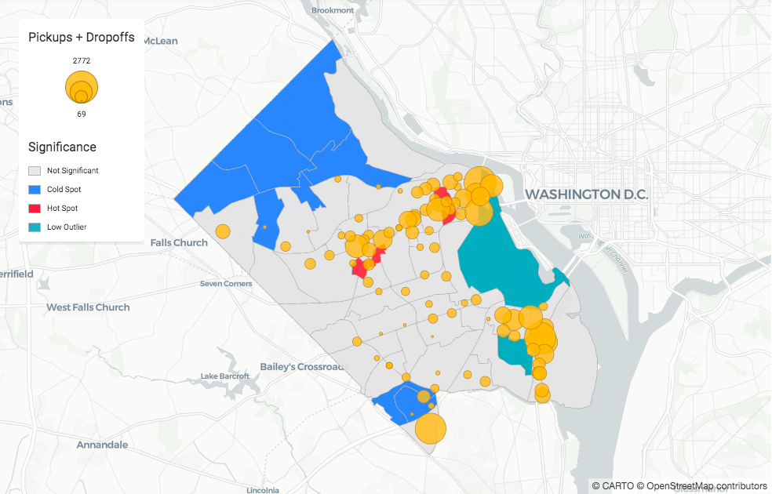
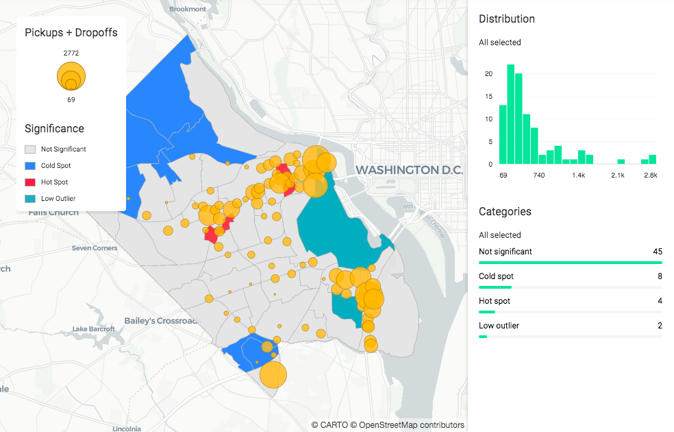

## Quickstart

Hi! Glad to see you made it to the Quickstart guide! In this guide you are introduced to how CARTOframes can be used by data scientists in spatial analysis workflows. Using bike share data, this guide walks through some common steps a data scientist takes to answer the following question: are the company's bike share stations placed in optimal locations?

Before you get started, we encourage you to have your environment ready so you can get a feel for the library by using it. If you don’t have your environment set-up yet, check out this guide first. You will need:

- A python notebook environment
- The CARTOframes library installed

### Spatial analysis scenario

Let's say you work for a bike share company in Arlington, Virginia and you want to better understand how your stations around the city are being used, and if these stations are placed in optimal locations.

To begin, let's outline a workflow: 

- Explore your company's data
- Discover and enrich data thanks to the CARTO catalog
- Analyse if the current bike stations are placed in optimal locations
- And finally, share the results of your analysis with your team

Let's get started!

### Explore your company's data

[This](../img/new-guides/quickstart/arlington_bikeshare_july_agg.geojson) is the dataset in [geojson](https://geojson.org) format you have to start your exploration. It contains information about the bike stations around the city of Arlington. As a first exploratory step, you read it into a Jupyter Notebook using a [Geopandas GeoDataframe](http://geopandas.org/reference/geopandas.GeoDataFrame.html).

```py
import geopandas as gpd

arlington_file = 'arlington_bikeshare_july_agg.geojson'
bikeshare_df = gpd.read_file(arlington_file)
bikeshare_df.head(3)
```


By only reading the data into a geodataframe you aren't able to see at a glance where the stations are. So let's visualize it in a map!

Note: In case your data hasn't been geocoded before, you can do it thanks to our Location Data Services. Learn how to geocode your data reading the [geocoding guide]().

You can visualize your geodataframes using the [Map]() and [Layer]() classes. Check the [visualization guide]() to know all the visualization possibilities and check the [sources guide]() to know about which data sources are supported.

```py
from cartoframes.viz import Map, Layer

Map(Layer(bikeshare_df))
```


Great! We have a map!

Now, that you have a better sense of about where the stations are located, it's time to continue with the exploration. The next question to answer is which stations around the city are most active. To visualize this on the map, you can use a CARTOframes layer helper. Using the column `total_events`, which is the number of dropoffs and pickups at each station for the past month, let’s try a visualization helper called `size_continuous_layer` to size each station by that value:

```py
from cartoframes.viz.helpers import size_continuous_layer

Map(size_continuous_layer(bikeshare_df, 'total_events'))
```


Good job! Now, just taking a look, you can see where are the stations with more activity. Also, thanks to be using a helper, we get a legend out of it.

To learn more about visualizating your data, about how to add legends, pop-ups, widgets and how to do it faster thanks to helpers, check the [visualization guide]().


### Discover and enrich data thanks to the CARTO catalog

You already know where your company stations are and their activity, now you want to know if they are in optimal locations. You start thinking about which data could be valuable to validate that and decide to check if there can be any correlation with households with no car data. Let's see how CARTOframes can help you finding that data and enrich yours.

First, we will use the CARTO [data observatory]() to discover the data we want, data about households with no cars. You can learn more about discovering data in the [data discovery guide]().

```py
from cartoframes.data.observatory.catalog import Catalog
from cartoframes.data import enrichment

countries = Catalog().countries()
usa_datasets = countries.get("usa").datasets()
acs_demo_tracts = usa_datasets.iloc[84]
acs_no_car = acs_demo_tracts.variables().iloc[[88]]
```

Now that we have found the data we were looking for, let's filter out our area of intereset, Arlington. To do that, first we need to load Arlington's boundaries (they can be found [here](https://gisdata-arlgis.opendata.arcgis.com/datasets/census-tract-2010-polygons?geometry=-77.761%2C38.787%2C-76.772%2C38.974)):

```py
arlington_tracts = gpd.read_file('./data/tracts/1/Census_Tract_2010_Polygons.shp').to_crs({'init': 'epsg:4326'})
```



Let's continue enriching that area with the data we found before. To be able to do so, you have to log in to CARTO. You will need to create an API key and use the method `set_default_credentials` to create a session. If you haven't created an API key yet, check the [authentication guide]() to learn how to get it.

Note: If you don't have an account yet, you can get a [free account]() if you are a student or [get a trial]() if you aren't.

```py
from cartoframes.auth import set_default_credentials

set_default_credentials(username='your_username', api_key='your_api_key')
```

Now, that you are logged in, let's enrich the Arlington tracts with the households with no car data and visualize them with another layer helper, the `color_continuous_layer`:

```py
from cartoframes.data import enrichment
from cartoframes.viz.helpers import color_continuous_layer

arlington_no_car_df = enrichment.enrich_polygons(arlington_tracts, acs_no_car, {'no_car': 'SUM'}, data_geom_column='geometry_wkt')
Map(color_continuous_layer(arlington_no_car_df, value='no_car', title='No cars households'))
```



Nice! Thanks to our layer helper, we can already see which are the areas with the highest percentage of households with no cars. You can learn more about discovering and enriching your data in the [data guide]().

### Analyse if the current bike stations are placed in optimal locations

We can already suggest which are the areas where can make more sense to have a station looking at the ones that have more households with no cars. In this step, let's try to go a bit further and try to calculate which areas have significantly high or low numbers of them. We will use the open source library [pySAL](https://pysal.org) for that.

You decide to use [Moran's I]() to measure the spatial autocorrelation and [Queen]() as the algorithm to decide which areas are considered neighbours. Once you are done with your analysis (here we are just showing a simplified version of it), you assign a label with the significance level to each station.

```py
from libpysal.weights import Queen
from pysal.explore.esda.moran import Moran_Local

wq = Queen.from_dataframe(arlington_no_car_df)
wq.transform = 'r'
li = Moran_Local(arlington_no_car_df['no_cars_2011_2015_by_households'], wq)
significance = 1 * (li.p_sim < 0.05)
spot_qs = [1, 3, 2, 4] # HH(hotspot), LL(coldspot), LH(doughnut), HL(diamond)
spots = sum([i * (significance * li.q==i) for i in spot_qs])

spot_labels = ['Not significant', 'Hot spot', 'Low outlier', 'Cold spot', 'Hot outlier']
labels = [spot_labels[i] for i in spots]
arlington_no_car_df = arlington_no_car_df.assign(cl=labels)
```

You have finished your analysis and now you want to see the results in a map, 
plotting the significance of each area. Let's do it!	

```py
from cartoframes.viz.helpers import color_category_layer

hmap = ['#E4E4E4','#1785FB', '#F24440', '#12A2B8']
Map([color_category_layer(arlington_no_car_df, 'cl', title='Significance', palette=hmap, stroke_color='#B5B5B5'),
     size_continuous_layer(bikeshare_df, 'total_events', 'Pickups + Dropoffs')])
```



Awesome! You have finished with your analysis and see that your company has done a good job placing the stations.

### Publish and share your results

To finish your work, you want to share the results with some teammates. Also, it would be great if you could allow them to play with the information. Let's do that!

First, you have to upload the data used by your maps to CARTO using the [Dataset]() class:

```py
from cartoframes.data import Dataset

Dataset(arlington_no_car_df).upload(table_name='arlington_ct_no_cars', credentials=creds, if_exists='replace')
Dataset(bikeshare_df).upload(table_name='bikeshare_july_agg', credentials=creds, if_exists='replace')
```

Now, let's add widgets so people are able to see some graphs about the information displayed and allow them to filter it. To do this, we only have to add `widget=True` to the helpers. Remember to check the [visualization guide]() to learn more about it.

```py
final_map = Map([
    color_category_layer('arlington_ct_no_cars', 'cl', title='Significance', palette=hmap, stroke_color='#B5B5B5', widget=True),
    size_continuous_layer('bikeshare_july_agg', 'total_events', 'Pickups + Dropoffs', widget=True)
])
final_map
```



Cool! Now that you have a small dashboard to play with, let's publish it to CARTO so you are able to share it with anyone. To do this, you just need to call the [publish]() method from the [Map]() class:

```py
final_map.publish('bikeshare_spots')
```


Congratulations! You have finished this guide and have a sense about how CARTOframes can speed up your workflow. To continue learning, you can check the specific guides, check the [reference]() to know everything about a class or a method or check the notebook [examples]().