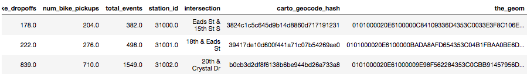
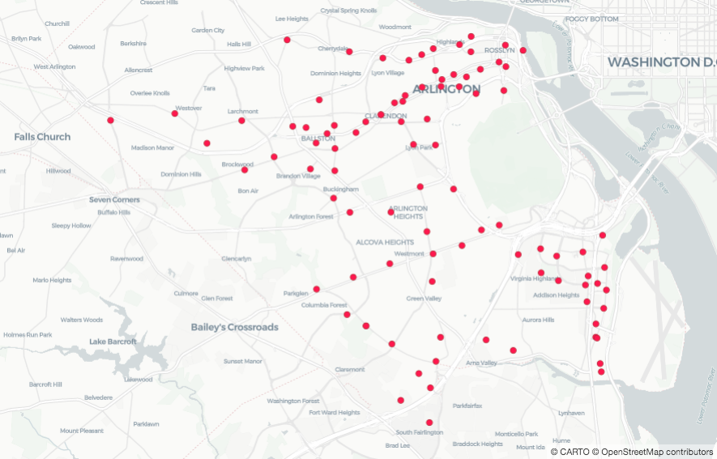
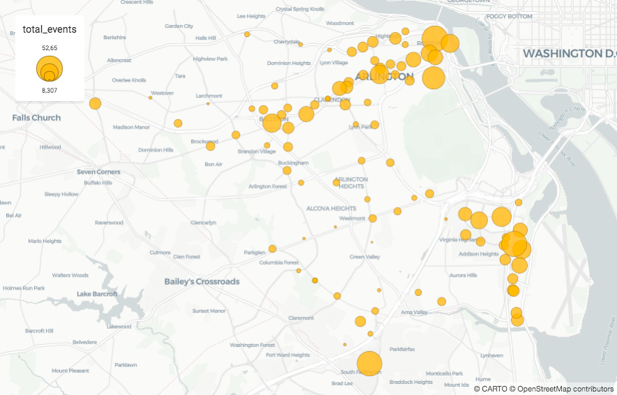

## Quickstart

Hi! Glad to see you around! This guide walks you through the common steps a data scientist has to follow in their spatial analyses and how CARTOframes can help in each of them. We will follow a real use case to show it. We encourage you to have your environment ready so you can learn how to use the library by using it. If you haven't done it yet, check this guide.

### Real use case

Imagine that you are a data scientist at a bikesharing company and you want to know how well the company has placed their stations. Apart from that, you would also like to recommend new spots so the company can continue growing. Before starting, you list the steps you have to follow to achieve it:

- Get and explore company's data
- Discover and get meaninful data
- Analyse which are the best and worst spots
- Share the results with your team

Let's start!


### Get and explore company's data

In order to start your work, you ask your team where you can find data about the bike stations. A team mate sends you the following file: TODO. This file contains information about the bike stations at Arlington and you check it using a pandas dataframe.

```py
import pandas as pd

arlington_file = 'arlington_bikeshare_july_agg.csv'
df = pd.read_csv(arlington_file)
df.head(3)
```


As you can see, reading a dataframe doesn't let you understand quickly where the stations are. You think it will be awesome to show the data in a map but before doing that, you need to transform the `intersection` column into geometries. This process is called geocoding and the CARTO platform provides an easy way to do it (you can know more about it in their own guide).

Let's log in to CARTO to continue. If you don't have an account yet, you can get a free account if you are a student or get a trial if you aren't. Learn more about it and how to get an API key checking the authentication guide.

Note: if your data is already geocoded, you can visualize it without a CARTO account.

```py
from cartoframes.auth import set_default_credentials

set_default_credentials(username='username', api_key='your_api_key')
```

Now, we are already prepared to geocode the dataframe:

```py
from cartoframes.data.services import Geocode

gc = Geocode()
df, info = gc.geocode(df, street='intersection', state="'Virginia'", city="'Arlington'", country="'US'")
df.head(3)
```


Done! That was easy, isn't it? Now we have a new column called `the_geom` with the geometries so we are prepared to visualize the data on a map. You can easily visualize your dataframes thanks to the Map and Layer classes. Check the visualization guide to know all the visualization possibilities and check the sources guide to know about which data sources are supported.

```py
from cartoframes.viz import Map, Layer

Map(Layer(df))
```



Great! Now, you have a better sense about where the stations are. To continue with your exploration, you want to know which are the stations with more activity. To do so, you can use the `size_continuous_layer` visualization helper taking into account the `total_events` column as the one that determines the activity:

```py
from cartoframes.viz.helpers import size_continuous_layer

Map(size_continuous_layer(arlington_file, 'total_events'))
```


Good job! Now, just taking a look, you can see where are the stations with more activity.

To learn more about visualizating your data, about how to add legends, pop-ups, widgets and how to do it faster thanks to helpers, check the visualization guide.
