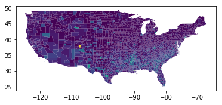

# Shapely, Geopandas, and CARTOframes

This notebook demonstrates how to use `cartoframes` with [GeoPandas](http://geopandas.org/), a popular Python package for working with geospatial data in a local environment. It's built on some of the same robust libraries as PostGIS which underlies CARTO's spatial analysis, so compliments CARTO extremely well.

Get started by creating a `CartoContext` that allows you to interact with CARTO in the notebook enviroment.


```python
%matplotlib inline
from cartoframes import CartoContext, Credentials
import geopandas as gpd
import pandas as pd
```


```python
# set carto credentials
creds = Credentials(key='abcdefg',
                    username='cartoframes')
creds.save()
cxn = CartoContext()
```

## Reading and writing data from/to CARTO

To get started, let's use the `nat` dataset which contains county-level criminology data for the United States from 1960 onwards.


```python
# load data into your account
from cartoframes.examples import read_nat

# write `nat` to your CARTO account
cxn.write(read_nat(), 'nat')

# download it and decode geometries
df = cxn.read('nat', decode_geom=True)
```

    Table successfully written to CARTO: https://cartoframes.carto.com/dataset/nat


```python
df.head()
```


<div>
<style>
    .dataframe thead tr:only-child th {
        text-align: right;
    }

    .dataframe thead th {
        text-align: left;
    }

    .dataframe tbody tr th {
        vertical-align: top;
    }
</style>
<table border="1" class="dataframe">
  <thead>
    <tr style="text-align: right;">
      <th></th>
      <th>blk60</th>
      <th>blk70</th>
      <th>blk80</th>
      <th>blk90</th>
      <th>cnty_fips</th>
      <th>cofips</th>
      <th>dnl60</th>
      <th>dnl70</th>
      <th>dnl80</th>
      <th>dnl90</th>
      <th>...</th>
      <th>state_fips</th>
      <th>state_name</th>
      <th>stfips</th>
      <th>the_geom</th>
      <th>the_geom_webmercator</th>
      <th>ue60</th>
      <th>ue70</th>
      <th>ue80</th>
      <th>ue90</th>
      <th>geometry</th>
    </tr>
    <tr>
      <th>cartodb_id</th>
      <th></th>
      <th></th>
      <th></th>
      <th></th>
      <th></th>
      <th></th>
      <th></th>
      <th></th>
      <th></th>
      <th></th>
      <th></th>
      <th></th>
      <th></th>
      <th></th>
      <th></th>
      <th></th>
      <th></th>
      <th></th>
      <th></th>
      <th></th>
      <th></th>
    </tr>
  </thead>
  <tbody>
    <tr>
      <th>2367</th>
      <td>17.515639</td>
      <td>17.566758</td>
      <td>13.96325</td>
      <td>13.449123</td>
      <td>449</td>
      <td>449</td>
      <td>3.692759</td>
      <td>3.687802</td>
      <td>3.951113</td>
      <td>4.068565</td>
      <td>...</td>
      <td>48</td>
      <td>Texas</td>
      <td>48</td>
      <td>0106000020E6100000010000000103000000010000000F...</td>
      <td>0106000020110F0000010000000103000000010000000F...</td>
      <td>4.2</td>
      <td>2.7</td>
      <td>5.027695</td>
      <td>5.863649</td>
      <td>(POLYGON ((-94.81377410888672 32.9882507324218...</td>
    </tr>
    <tr>
      <th>2148</th>
      <td>0.000000</td>
      <td>0.007520</td>
      <td>0.01176</td>
      <td>0.000000</td>
      <td>113</td>
      <td>113</td>
      <td>2.634145</td>
      <td>2.739525</td>
      <td>2.983983</td>
      <td>3.004824</td>
      <td>...</td>
      <td>5</td>
      <td>Arkansas</td>
      <td>5</td>
      <td>0106000020E6100000010000000103000000010000000F...</td>
      <td>0106000020110F0000010000000103000000010000000F...</td>
      <td>7.2</td>
      <td>5.4</td>
      <td>5.717978</td>
      <td>5.524099</td>
      <td>(POLYGON ((-93.92706298828125 34.3524627685546...</td>
    </tr>
    <tr>
      <th>16</th>
      <td>0.000000</td>
      <td>0.000000</td>
      <td>0.00000</td>
      <td>0.443038</td>
      <td>75</td>
      <td>75</td>
      <td>1.668175</td>
      <td>1.463381</td>
      <td>1.417714</td>
      <td>1.284332</td>
      <td>...</td>
      <td>38</td>
      <td>North Dakota</td>
      <td>38</td>
      <td>0106000020E6100000010000000103000000010000000C...</td>
      <td>0106000020110F0000010000000103000000010000000C...</td>
      <td>4.1</td>
      <td>6.0</td>
      <td>3.935185</td>
      <td>6.328182</td>
      <td>(POLYGON ((-101.0608749389648 48.4602966308593...</td>
    </tr>
    <tr>
      <th>258</th>
      <td>0.000000</td>
      <td>0.000000</td>
      <td>0.00000</td>
      <td>0.000000</td>
      <td>49</td>
      <td>49</td>
      <td>1.484931</td>
      <td>1.363188</td>
      <td>1.198477</td>
      <td>1.009217</td>
      <td>...</td>
      <td>46</td>
      <td>South Dakota</td>
      <td>46</td>
      <td>0106000020E61000000100000001030000000100000006...</td>
      <td>0106000020110F00000100000001030000000100000006...</td>
      <td>2.8</td>
      <td>0.3</td>
      <td>0.539291</td>
      <td>1.962388</td>
      <td>(POLYGON ((-98.72162628173828 44.8916778564453...</td>
    </tr>
    <tr>
      <th>27</th>
      <td>0.000000</td>
      <td>0.000000</td>
      <td>0.00000</td>
      <td>0.000000</td>
      <td>19</td>
      <td>19</td>
      <td>0.956364</td>
      <td>0.759179</td>
      <td>0.686538</td>
      <td>0.463073</td>
      <td>...</td>
      <td>30</td>
      <td>Montana</td>
      <td>30</td>
      <td>0106000020E6100000010000000103000000010000000E...</td>
      <td>0106000020110F0000010000000103000000010000000E...</td>
      <td>3.7</td>
      <td>0.4</td>
      <td>2.112676</td>
      <td>1.428571</td>
      <td>(POLYGON ((-105.8138580322266 48.5703468322753...</td>
    </tr>
  </tbody>
</table>
<p>5 rows × 72 columns</p>
</div>


By default, CARTO uses Well-known-binary (WKB) serialization for geometries that come out of PostGIS.


```python
df.head(2)[['fipsno', 'the_geom']]
```


<div>
<table border="1" class="dataframe">
  <thead>
    <tr style="text-align: right;">
      <th></th>
      <th>fipsno</th>
      <th>the_geom</th>
    </tr>
    <tr>
      <th>cartodb_id</th>
      <th></th>
      <th></th>
    </tr>
  </thead>
  <tbody>
    <tr>
      <th>364</th>
      <td>27101.0</td>
      <td>0106000020E61000000100000001030000000100000007...</td>
    </tr>
    <tr>
      <th>1660</th>
      <td>20019.0</td>
      <td>0106000020E61000000100000001030000000100000006...</td>
    </tr>
  </tbody>
</table>
</div>


These strings can be deserialized into `shapely` objects that work with GeoPandas.


```python
df.head(2)[['fipsno', 'geometry']]
```


<div>
<style>
    .dataframe thead tr:only-child th {
        text-align: right;
    }

    .dataframe thead th {
        text-align: left;
    }

    .dataframe tbody tr th {
        vertical-align: top;
    }
</style>
<table border="1" class="dataframe">
  <thead>
    <tr style="text-align: right;">
      <th></th>
      <th>fipsno</th>
      <th>geometry</th>
    </tr>
    <tr>
      <th>cartodb_id</th>
      <th></th>
      <th></th>
    </tr>
  </thead>
  <tbody>
    <tr>
      <th>2367</th>
      <td>48449</td>
      <td>(POLYGON ((-94.81377410888672 32.9882507324218...</td>
    </tr>
    <tr>
      <th>2148</th>
      <td>5113</td>
      <td>(POLYGON ((-93.92706298828125 34.3524627685546...</td>
    </tr>
  </tbody>
</table>
</div>


This allows you to do GIS operations locally in Geopandas. To send a DataFrame with shapely geometries into a Geopandas DataFrame, you only need to call the constructor directly on the DataFrame:


```python
gdf = gpd.GeoDataFrame(df)
gdf.plot('hr90', linewidth=0.1) # to prove we're in geopandas
```


    <matplotlib.axes._subplots.AxesSubplot at 0x10f47a240>





The nice thing with having the code to serialize/deserialize `shapely` objects is that you can publish directly to CARTO (and make CARTO maps) directly from (geo)pandas:


```python
from cartoframes import Layer, styling
cxn.map(layers=Layer('nat', color={'column': 'hr90',
                                   'scheme': styling.sunset(7)}),
        interactive=False)
```


    <matplotlib.axes._subplots.AxesSubplot at 0x111789358>


You can also create interactive versions of the above map by setting `interactive=True`.

**Note:** If viewing this notebook on GitHub, the interactive map will not display. Checkout this same [notebook rendered on nbviewer](https://nbviewer.jupyter.org/github/CartoDB/cartoframes/blob/master/examples/Shapely%2C%20Geopandas%2C%20and%20Cartoframes.ipynb) instead.


```python
from cartoframes import Layer, styling
cxn.map(layers=Layer('nat', color={'column': 'hr90',
                                   'scheme': styling.sunset(7)}),
        interactive=True)
```


<iframe srcdoc="<!DOCTYPE html>
<html>
  <head>
    <title>Carto</title>
    <meta name='viewport' content='initial-scale=1.0, user-scalable=no' />
    <meta http-equiv='content-type' content='text/html; charset=UTF-8' />
    <link rel='shortcut icon' href='http://cartodb.com/assets/favicon.ico' />

    <style>
     html, body, #map {
       height: 100%;
       padding: 0;
       margin: 0;
     }
     #zoom-center {
       position: absolute;
       right: 0;
       top: 0;
       background-color: rgba(255, 255, 255, 0.7);
       width: 240px;
       z-index: 100;
       padding: 4px;
     }
    </style>

    <link rel='stylesheet' href='https://cartodb-libs.global.ssl.fastly.net/cartodb.js/v3/3.15/themes/css/cartodb.css' />
  </head>
  <body>
    <div id='zoom-center'>
      zoom=<span id='zoom'>4</span>,
      lng=<span id='lon'>No data</span>, lat=<span id='lat'>No data</span></div>
    <div id='map'></div>
    <script src='https://cartodb-libs.global.ssl.fastly.net/cartodb.js/v3/3.15/cartodb.js'></script>

    <script>
     const config  = {&quot;user_name&quot;: &quot;eschbacher&quot;, &quot;maps_api_template&quot;: &quot;https://eschbacher.carto.com&quot;, &quot;sql_api_template&quot;: &quot;https://eschbacher.carto.com&quot;, &quot;tiler_protocol&quot;: &quot;https&quot;, &quot;tiler_domain&quot;: &quot;carto.com&quot;, &quot;tiler_port&quot;: &quot;80&quot;, &quot;type&quot;: &quot;namedmap&quot;, &quot;named_map&quot;: {&quot;name&quot;: &quot;cartoframes_ver20170406_layers1_time0_baseid2_labels1_zoom0&quot;, &quot;params&quot;: {&quot;basemap_url&quot;: &quot;https://{s}.basemaps.cartocdn.com/rastertiles/voyager_nolabels/{z}/{x}/{y}.png&quot;, &quot;cartocss_0&quot;: &quot;#layer {  polygon-fill: ramp([hr90], cartocolor(Sunset), quantiles(7), >); polygon-opacity: 0.9; polygon-gamma: 0.5; line-color: #FFF; line-width: 0.5; line-opacity: 0.25; line-comp-op: hard-light;}#layer[hr90 = null] {  polygon-fill: #ccc;}&quot;, &quot;sql_0&quot;: &quot;SELECT * FROM nat&quot;, &quot;west&quot;: -124.731422424316, &quot;south&quot;: 24.9559669494629, &quot;east&quot;: -66.9698486328125, &quot;north&quot;: 49.3717346191406}}};
     const bounds  = [[49.3717346191406, -66.9698486328125], [24.9559669494629, -124.731422424316]];
     const options = {&quot;filter&quot;: [&quot;mapnik&quot;, &quot;torque&quot;], &quot;https&quot;: true};
     var labels_url = 'https://{s}.basemaps.cartocdn.com/rastertiles/voyager_only_labels/{z}/{x}/{y}.png';

     const adjustLongitude = (lng) => (
       lng - ((Math.ceil((lng + 180) / 360) - 1) * 360)
     );
     const map = L.map('map', {
       zoom: 3,
       center: [0, 0],
     });

     if (L.Browser.retina) {
         var basemap = config.named_map.params.basemap_url.replace('.png', '@2x.png');
         labels_url = labels_url.replace('.png', '@2x.png');
     } else {
         var basemap = config.named_map.params.basemap_url;
     }
     L.tileLayer(basemap, {
         attribution: &quot;&copy; <a href=\&quot;http://www.openstreetmap.org/copyright\&quot;>OpenStreetMap</a>&quot;
     }).addTo(map);

     const updateMapInfo = () => {
       $('#zoom').text(map.getZoom());
       $('#lat').text(map.getCenter().lat.toFixed(4));
       $('#lon').text(adjustLongitude(map.getCenter().lng).toFixed(4));
     };

     cartodb.createLayer(map, config, options)
            .addTo(map)
            .done((layer) => {
                // add labels layer
                if (labels_url) {
                    var topPane = L.DomUtil.create('div', 'leaflet-top-pane', map.getPanes().mapPane);
                    var topLayer = new L.tileLayer(labels_url).addTo(map);
                    topPane.appendChild(topLayer.getContainer());
                    topLayer.setZIndex(7);
                 }

                // fit map to bounds
                if (bounds.length) {
                  map.fitBounds(bounds);
                }

                updateMapInfo();
                map.on('move', () => {
                  updateMapInfo();
                });
            })
            .error((err) => {
              console.log('ERROR: ', err);
            });
    </script>

  </body>
</html>
" width="100%" height="400">  Preview image: </iframe>


GeoPandas DataFrames can be written to CARTO just like pandas DataFrames.


```python
cxn.write(gdf,
          encode_geom=True,
          table_name='cartoframes_geopandas',
          overwrite=True)
```

    Table successfully written to CARTO: https://cartoframes.carto.com/dataset/cartoframes_geopandas


If you change the geometries locally, the changes propagate back to CARTO:


```python
gdf['geometry'] = gdf.geometry.apply(lambda x: x.buffer(2))
df['geometry'] = df.geometry.apply(lambda x: x.buffer(2))
```


```python
cxn.write(gdf, encode_geom=True,
          table_name='cartoframes_geopandas_buffered',
          overwrite=True)
```

    Table successfully written to CARTO: https://cartoframes.carto.com/dataset/cartoframes_geopandas_buffered


```python
gdf.head()
```


<div>
<style>
    .dataframe thead tr:only-child th {
        text-align: right;
    }

    .dataframe thead th {
        text-align: left;
    }

    .dataframe tbody tr th {
        vertical-align: top;
    }
</style>
<table border="1" class="dataframe">
  <thead>
    <tr style="text-align: right;">
      <th></th>
      <th>blk60</th>
      <th>blk70</th>
      <th>blk80</th>
      <th>blk90</th>
      <th>cnty_fips</th>
      <th>cofips</th>
      <th>dnl60</th>
      <th>dnl70</th>
      <th>dnl80</th>
      <th>dnl90</th>
      <th>...</th>
      <th>state_fips</th>
      <th>state_name</th>
      <th>stfips</th>
      <th>the_geom</th>
      <th>the_geom_webmercator</th>
      <th>ue60</th>
      <th>ue70</th>
      <th>ue80</th>
      <th>ue90</th>
      <th>geometry</th>
    </tr>
    <tr>
      <th>cartodb_id</th>
      <th></th>
      <th></th>
      <th></th>
      <th></th>
      <th></th>
      <th></th>
      <th></th>
      <th></th>
      <th></th>
      <th></th>
      <th></th>
      <th></th>
      <th></th>
      <th></th>
      <th></th>
      <th></th>
      <th></th>
      <th></th>
      <th></th>
      <th></th>
      <th></th>
    </tr>
  </thead>
  <tbody>
    <tr>
      <th>2367</th>
      <td>17.515639</td>
      <td>17.566758</td>
      <td>13.96325</td>
      <td>13.449123</td>
      <td>449</td>
      <td>449</td>
      <td>3.692759</td>
      <td>3.687802</td>
      <td>3.951113</td>
      <td>4.068565</td>
      <td>...</td>
      <td>48</td>
      <td>Texas</td>
      <td>48</td>
      <td>0103000000010000004c000000110ff66c84d157c0f09c...</td>
      <td>0106000020110F0000010000000103000000010000000F...</td>
      <td>4.2</td>
      <td>2.7</td>
      <td>5.027695</td>
      <td>5.863649</td>
      <td>POLYGON ((-95.27370761899171 31.04432885782165...</td>
    </tr>
    <tr>
      <th>2148</th>
      <td>0.000000</td>
      <td>0.007520</td>
      <td>0.01176</td>
      <td>0.000000</td>
      <td>113</td>
      <td>113</td>
      <td>2.634145</td>
      <td>2.739525</td>
      <td>2.983983</td>
      <td>3.004824</td>
      <td>...</td>
      <td>5</td>
      <td>Arkansas</td>
      <td>5</td>
      <td>0103000000010000004c000000eb5432f7cb7c57c063bb...</td>
      <td>0106000020110F0000010000000103000000010000000F...</td>
      <td>7.2</td>
      <td>5.4</td>
      <td>5.717978</td>
      <td>5.524099</td>
      <td>POLYGON ((-93.94994907298285 36.6935937156584,...</td>
    </tr>
    <tr>
      <th>16</th>
      <td>0.000000</td>
      <td>0.000000</td>
      <td>0.00000</td>
      <td>0.443038</td>
      <td>75</td>
      <td>75</td>
      <td>1.668175</td>
      <td>1.463381</td>
      <td>1.417714</td>
      <td>1.284332</td>
      <td>...</td>
      <td>38</td>
      <td>North Dakota</td>
      <td>38</td>
      <td>0103000000010000004c000000a1c34ac301e759c0860d...</td>
      <td>0106000020110F0000010000000103000000010000000C...</td>
      <td>4.1</td>
      <td>6.0</td>
      <td>3.935185</td>
      <td>6.328182</td>
      <td>POLYGON ((-103.6094825964087 47.5185228488654,...</td>
    </tr>
    <tr>
      <th>258</th>
      <td>0.000000</td>
      <td>0.000000</td>
      <td>0.00000</td>
      <td>0.000000</td>
      <td>49</td>
      <td>49</td>
      <td>1.484931</td>
      <td>1.363188</td>
      <td>1.198477</td>
      <td>1.009217</td>
      <td>...</td>
      <td>46</td>
      <td>South Dakota</td>
      <td>46</td>
      <td>01030000000100000047000000726e9852332e58c02e30...</td>
      <td>0106000020110F00000100000001030000000100000006...</td>
      <td>2.8</td>
      <td>0.3</td>
      <td>0.539291</td>
      <td>1.962388</td>
      <td>POLYGON ((-96.72188248525507 44.92368954847949...</td>
    </tr>
    <tr>
      <th>27</th>
      <td>0.000000</td>
      <td>0.000000</td>
      <td>0.00000</td>
      <td>0.000000</td>
      <td>19</td>
      <td>19</td>
      <td>0.956364</td>
      <td>0.759179</td>
      <td>0.686538</td>
      <td>0.463073</td>
      <td>...</td>
      <td>30</td>
      <td>Montana</td>
      <td>30</td>
      <td>0103000000010000004e000000d07d8644a7ff5ac00553...</td>
      <td>0106000020110F0000010000000103000000010000000E...</td>
      <td>3.7</td>
      <td>0.4</td>
      <td>2.112676</td>
      <td>1.428571</td>
      <td>POLYGON ((-107.9945842088121 49.70426177527956...</td>
    </tr>
  </tbody>
</table>
<p>5 rows × 72 columns</p>
</div>


```python
from cartoframes import BaseMap, Layer
cxn.map(layers=[BaseMap('light'),
                Layer('cartoframes_geopandas_buffered',
                         color='gi69')],
        interactive=False)
```


    <matplotlib.axes._subplots.AxesSubplot at 0x1130fac88>


