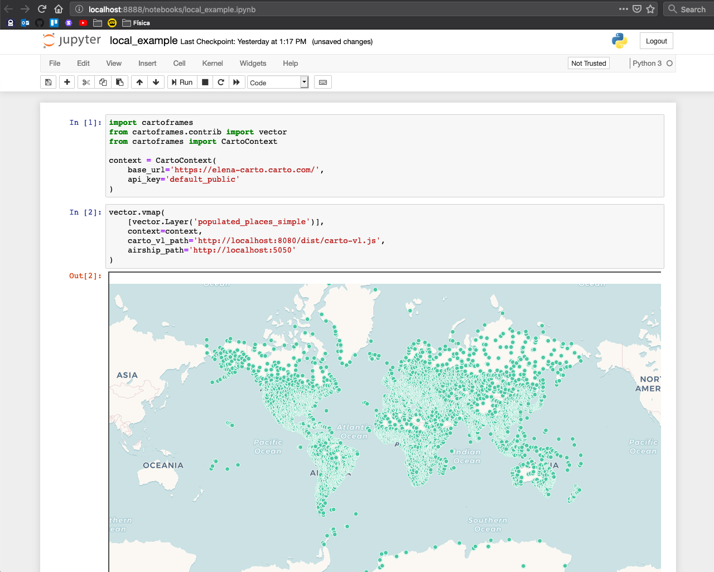

Local Development Setup
=======================

Let's run a local Jupyter Notebook with CARTOFrames, CARTO VL and Airship for local development.

Jupyter Notebook
^^^^^^^^^^^^^^^^

1. Install Python

MacOS:

.. code::

  brew install python3

.. code::

  brew postinstall python3

Linux:

.. code::

  sudo apt-get install python3.6

2. Install Pipenv

MacOS:

.. code::

  brew install pipenv

Linux:

.. code::

  pip install pipenv

3. Create directory and clone CARTOFrames repository

  Note: This is a recommendation to set up your workspace.

.. code::

  mkdir jupyter-cartoframes
  cd jupyter-cartoframes
  git clone git@github.com:CartoDB/cartoframes.git

4. Create virtualenv

.. code::
  
  python3 -m virtualenv <your env name>

5. Install jupyter 

.. code::

  pipenv install jupyter

6. Install cartoframes package in dev mode using pipenv

.. code::

  pipenv install -e cartoframes

7. Launch virtual environment

.. code::

  pipenv shell

8. Activate the virtual environment

.. code::

  source env/bin/activate

9. Launch Jupyter notebook

.. code::

  jupyter notebook

CARTO VL
^^^^^^^^

We're going to clone the repository. We can do it in the jupyter-cartoframes directory we've created to set up our local workspace.

.. code::

  cd jupyter-cartoframes
  git clone git@github.com:CartoDB/carto-vl.git
  cd carto-vl

The local installation of CARTO VL is explained `in this guide <https://github.com/CartoDB/carto-vl/blob/master/DEVELOPERS.md/>`__ 

Airship
^^^^^^^^

Let's clone the Airship repository as well.

.. code::

  cd jupyter-cartoframes
  git clone git@github.com:CartoDB/airship.git
  cd airship

The local installation of Airship is explained `in this guide <https://github.com/CartoDB/airship/blob/master/DEVELOPERS.md/>`__ 

Run all the projects
^^^^^^^^^^^^^^^^^^^^

We've to serve now all the projects as follows:

.. code::

  +---------------------------+---------------------------+
  |/carto-vl                  |/carto-vl                  |
  |$ npm run build:watch      | $ npm run serve           |
  |                           |                           |
  |                           |                           |
  |                           |                           |
  +---------------------------+---------------------------+
  |/airship                   |/airship                   |
  |$ npm run dev              | $ npm run serve           |
  |                           |                           |
  |                           |                           |
  |                           |                           |
  +---------------------------+---------------------------+
  |/cartoframes               |                           |
  |(env)$ jupyter notebook    |                           |
  |                           |                           |
  |                           |                           |
  |                           |                           |
  +---------------------------+---------------------------+

Load JavaScript libraries locally
^^^^^^^^^^^^^^^^^^^^^^^^^^^^^^^^^

In order to get Airship and CARTO VL libraries we're serving locally in CARTOFrames, we need to instantiate the map indicating the paths:

.. code:: python

  import cartoframes
  from cartoframes.contrib import vector
  from cartoframes import CartoContext

  context = CartoContext(
      base_url='https://cartoframes.carto.com/', # or https://cartovl.carto.com/
      api_key='default_public'
  )

  vector.vmap(
      [vector.Layer('dataset_name')],
      context=context,
      _carto_vl_path='http://localhost:8080/dist/carto-vl.js',
      _airship_path='http://localhost:5050'
  )

We've a lot of public datasets in both `cartoframes` and `cartovl` accounts that we use for the examples, but I've you've a personal CARTO account you can use your credentials.

Reload changes
^^^^^^^^^^^^^^

When making changes in CARTOFrames library, in the notebook, click on kernel > Restart and Run all. When making changes in CARTO VL or Airship, click on run (the page doesn't need to be reloaded)

